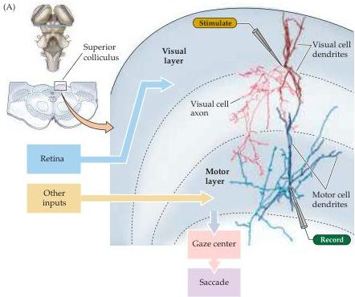
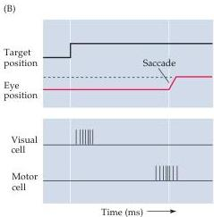
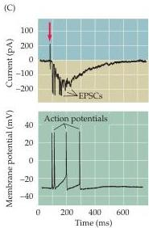

Eye Movements and Sensory Motor Integration 463

(A) The superior colliculus receives visual input from the retina and sends a command signal to the gaze centers to initiate a saccade (see text).
In the experiment illustrated here, a stimulating electrode activates cells in the visual layer and a patch clamp pipette records the response evoked in a neuron in the subjacent motor layer.
The cells in the visual and motor layers were subsequently labeled with a tracer called biocytin.
This experiment demonstrates that the terminals of the visual neuron are located in the same region as the dendrites of the motor neuron.
(B) The onset of a target in the visual field (top trace) is followed after a short interval by a saccade to foveate the target (second trace).
In the superior colliculus, the visual cell responds shortly after the onset of the target, while the motor cell responds later, just before the onset of the saccade.
(C) Bursts of excitatory postsynaptic currents (EPSCs) recorded from a motor layer neuron in response to a brief (0.5 ms) current stimulus applied via a steel wire electrode in the visual layer (top; see arrow).
These synaptic currents generate bursts of action potentials in the same cell (bottom).
(B after Wurtz and Albano, 1980; C after Ozen et al., 2000.)

Ozen, G., G.
J.
AUGUSTINE AND W.
C.
HALL (2000) Contribution of superficial layer neurons to premotor bursts in the superior colliculus.
J.
Neurophysiol.
84: 460-471.
SCHILLER, P.
H.
AND M.
STRYKER (1972) Single-unit recording and stimulation in superior colliculus of the alert rhesus monkey.
J.
Neurophysiol.
35: 915-924.
SPARKS, D.
L.
AND J.
S.
NELSON (1987) Sensory and motor maps in the mammalian superior colliculus.
TINS 10: 312-317.
WURTZ, R.
H.
AND J.
E.
ALBANO (1980) Visual-motor function of the primate superior colliculus.
Annu.
Rev.
Neurosci.
3: 189-226.

limited to the PPRF.) The frontal eye field can thus control eye movements by activating selected populations of superior colliculus neurons.
This cortical area also projects directly to the contralateral PPRF; as a result, the frontal eye field can also control eye movements independently of the superior colliculus.
The parallel inputs to the PPRF from the frontal eye field and superior colliculus are reflected in the deficits that result from damage to these