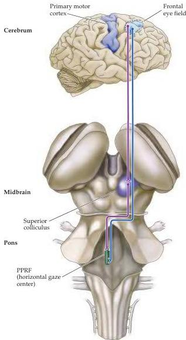

Chapter Nineteen

Figure 19.9 The relationship of the frontal eye field in the right cerebral hemisphere (Brodmann's area 8) to the superior colliculus and the horizontal gaze center (PPRF).
There are two routes by which the frontal eye field can influence eye movements in humans: indirectly by projections to the superior colliculus, which in turn projects to the contralateral PPRF, and directly by projections to the contralateral PPRF.

structures.
Injury to the frontal eye field results in an inability to make saccades to the contralateral side and a deviation of the eyes to the side of the lesion.
These effects are transient, however; in monkeys with experimentally induced lesions of this cortical region, recovery is virtually complete in two to four weeks.
Lesions of the superior colliculus change the accuracy, frequency, and velocity of saccades; yet saccades still occur, and the deficits also improve with time.
These results suggest that the frontal eye fields and the superior colliculus provide complementary pathways for the control of saccades.
Moreover, one of these structures appears to be able to compensate (at least partially) for the loss of the other.
In support of this interpretation, combined lesions of the frontal eye field and the superior colliculus produce a dramatic and permanent loss in the ability to make saccadic eye movements.

These observations do not, however, imply that the frontal eye fields and the superior colliculus have the same functions.
Superior colliculus lesions