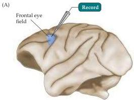
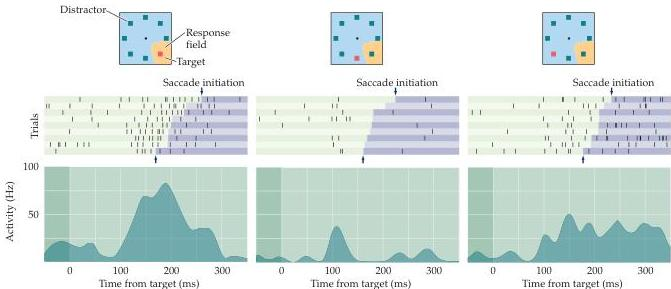

Eye Movements and Sensory Motor Integration 465

produce a permanent deficit in the ability to perform very short latency reflex-like eye movements called "express saccades." The express saccades are evidently mediated by direct pathways to the superior colliculus from the retina or visual cortex that can access the upper motor neurons in the colliculus without extensive, and more time-consuming, processing in the frontal cortex (see Box B).
In contrast, frontal eye field lesions produce permanent deficits in the ability to make saccades that are not guided by an external target.
For example, patients (or monkeys) with a lesion in the frontal eye fields cannot voluntarily direct their eyes away from a stimulus in the visual field, a type of eye movement called an "antisaccade." Such lesions also eliminate the ability to make a saccade to the remembered location of a target that is no longer visible.

Finally, the frontal eye fields are essential for systematically scanning the visual field to locate an object of interest within an array of distracting objects (see Figure 19.1).
Figure 19.10 shows the responses of a frontal eye field neuron during a visual task in which a monkey was required to foveate a target located within an array of distracting objects.
This frontal eye field

Figure 19.10 Responses of neurons in the frontal eye fields.
(A) Locus of the left frontal eye field on a lateral view of the rhesus monkey brain.
(B) Activation of a frontal eye field neuron during visual search for a target.
The vertical tickmarks represent action potentials, and each row of tick marks is a different trial.
The graphs below show the average frequency of action potentials as a function of time.
The change in color from green to purple in each row indicates the time of onset of a saccade toward the target.
In the left trace (1), the target (red square) is in the part of the visual field "seen" by the neuron, and the response to the target is similar to the response that would be generated by the neuron even if no distractors (green squares) were present (not shown).
In the right trace (3), the target is far from the response field of the neuron.
The neuron responds to the distractor in its response field.
However, it responds at a lower rate than it would to exactly the same stimulus if the square were not a distractor but a target for a saccade (left trace).
In the middle trace (2), the response of the neuron to the distractor has been sharply reduced by the presence of the target in a neighboring region of the visual field.
(After Schall, 1995.)

(1) Target in response field
(2) Target adjacent to response field