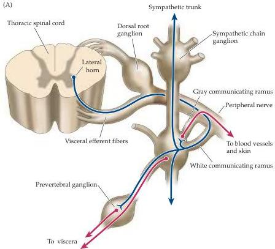
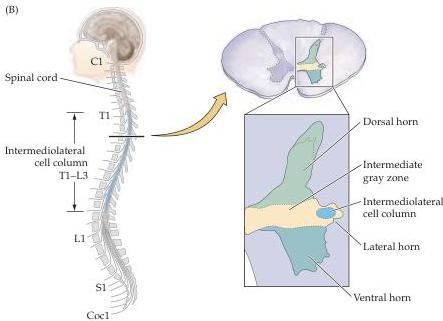

The Visceral Motor System

neurons that extends from the uppermost thoracic to the upper lumbar segments (T1 to L2 or L3; Table 20.1) in a region of the spinal cord gray matter called the intermediolateral column or lateral horn (Figure 20.2).
The preganglionic neurons that control sympathetic outflow to the organs in the

Figure 20.2 Organization of the preganglionic spinal outflow to sympathetic ganglia.
(A) General organization of the sympathetic division of the visceral motor system in the spinal cord and the preganglionic outflow to the sympathetic ganglia that contain the primary visceral motor neurons.
(B) Cross section of thoracic spinal cord at the level indicated, showing location of the sympathetic preganglionic neurons in the intermediolateral cell column of the lateral horn.