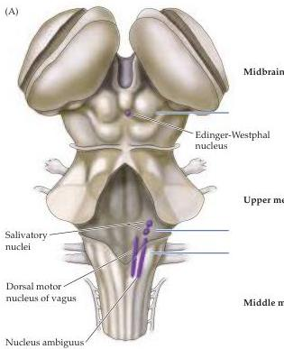
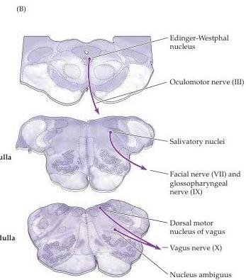
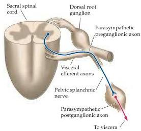
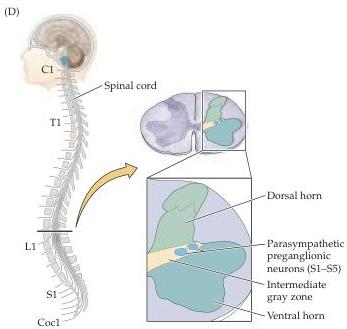

Chapter Twenty

(C)

Figure 20.3 Organization of the preganglionic outflow to parasympathetic ganglia.
(A) Dorsal view of brainstem showing the location of the nuclei of the cranial part of the parasympathetic division of the visceral motor system.
(B) Cross section of the brainstem at the relevant levels [indicated by horizontal lines in (A)] showing location of these parasympathetic nuclei.
(C) Main features of the parasympathetic preganglionics in the sacral segments of the spinal cord.
(D) Cross section of the sacral spinal cord showing location of sacral preganglionic neurons.

sylvius