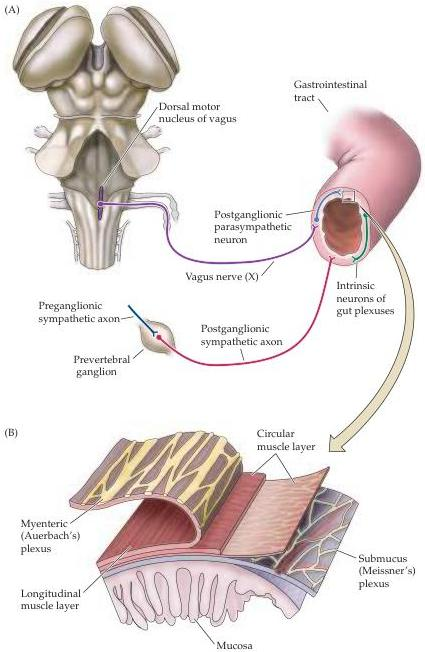

The Visceral Motor System

# The Enteric Nervous System

An enormous number of neurons are specifically associated with the gastrointestinal tract to control its many functions; indeed, more neurons are said to reside in the human gut than in the entire spinal cord.
As already noted, the activity of the gut is modulated by both the sympathetic and the parasympathetic divisions of the visceral motor system.
However, the gut also has an extensive system of nerve cells in its wall (as do its accessory organs such as the pancreas and gallbladder) that do not fit neatly into the sympathetic or parasympathetic divisions of the visceral motor system (Figure 20.4A).
To a surprising degree, these neurons and the complex enteric

Figure 20.4 Organization of the enteric component of the visceral motor system.
(A) Sympathetic and parasympathetic innervation of the enteric nervous system, and the intrinsic neurons of the gut.
(B) Detailed organization of nerve cell plexuses in the gut wall.
The neurons of the submucus plexus (Meissner's plexus) are concerned with the secretory aspects of gut function, and the myenteric plexus (Auerbach's plexus) with the motor aspects of gut function (e.g., peristalsis).