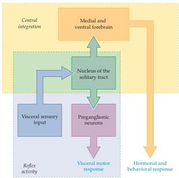

The Visceral Motor System 481

Figure 20.5 Distribution of visceral sensory information by the nucleus of the solitary tract to serve either local reflex responses or more complex hormonal and behavioral responses via integration within a central autonomic network.
As illustrated in Figure 20.7, forebrain centers also provide input to visceral motor effector systems in the brainstem and spinal cord.

or the presence of irritating chemicals.
The central axonal processes of these dorsal root ganglion neurons terminate on second-order neurons and local interneurons in the dorsal horn and on intermediate gray regions of the spinal cord.
Some primary visceral sensory axons terminate near the lateral horn, where the preganglionic neurons of sympathetic and parasympathetic divisions are located; these terminals mediate visceral reflex activity in a manner not unlike the segmental somatic motor reflexes described in Chapter 15.

In the dorsal horn, many of the second-order neurons that receive visceral sensory inputs are actually neurons of the anterolateral system, which also receive nociceptive and/or crude mechanosensory input from more superficial sources (see Chapter 9).
As described in Box A of Chapter 9, this is one means by which painful visceral sensations may be "referred" to more superficial somatic territories.
Axons of these second-order visceral sensory neurons travel rostrally in the ventrolateral white matter of the spinal cord and the lateral sector of the brainstem and eventually reach the ventral posterior complex of the thalamus.
However, the axons of other second-order visceral sensory neurons terminate before reaching the thalamus; the principal target of these axons is the nucleus of the solitary tract (Figure 20.6).
Other brainstem targets of second-order visceral sensory axons are visceral motor centers in the medullary reticular formation (see Box A in Chapter 16).

In the last decade, it has become clear that visceral sensory information, especially axons related to painful visceral sensations, also ascends the central nervous system by another spinal pathway.
Second-order neurons whose cell bodies are located near the central canal of the spinal cord send their axons through the dorsal columns to terminate in the dorsal column