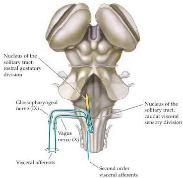

Chapter Twenty

Figure 20.6 Organization of sensory input to the visceral motor system.
Afferent input from the cranial nerves relevant to visceral sensation (as well as afferent input ascending from the spinal cord not shown here) converge on the caudal division of the nucleus of the solitary tract (the rostral division is a gustatory relay; see Chapter 14).

nuclei, where third-order neurons relay visceral nociceptive signals to the ventral posterior thalamus.
Although the existence of this visceral pain pathway in the dorsal columns complicates the simplistic view of the dorsal column-medial lemniscal pathway as a discriminative mechanosensory projection and the anterolateral system as a pain pathway, mounting empirical and clinical evidence highlights the importance of this newly discovered dorsal column pain pathway in the central transmission of visceral nociception (see Box B in Chapter 9).

In addition to these spinal visceral afferents, general visceral sensory inputs from thoracic and upper abdominal organs, as well as from viscera in the head and neck, enter the brainstem directly via the glossopharyngeal and vagus cranial nerves (see Figure 20.6).
These glossopharyngeal and vagal visceral afferents also terminate in the nucleus of the solitary tract.
This nucleus, as described in the next section, integrates a wide range of visceral sensory information and transmits this information directly (and indirectly) to relevant visceral motor nuclei, the brainstem reticular formation, as well as several key regions in the medial and ventral forebrain that coordinate visceral motor activity (see Figure 20.5).

Finally, unlike the somatic sensory system (where virtually all sensory signals gain access to conscious neural processing), sensory fibers related to the viscera convey only limited information to consciousness.
For example, most of us are completely unaware of the subtle changes in peripheral vascular resistance that raise or lower our mean arterial blood pressure, yet such covert visceral afferent information is essential for the functioning of autonomic reflexes and the maintenance of homeostasis.
Typically, it is only painful visceral sensations and signals that are integrated into emotional experience and expression (see Chapter 28) that enter conscious awareness.