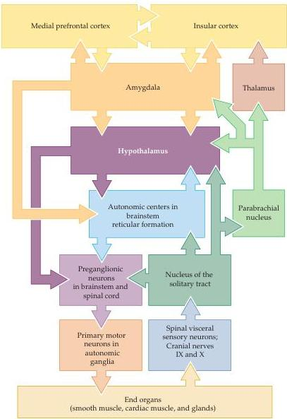

The Visceral Motor System

# Central Control of Visceral Motor Functions

The nucleus of the solitary tract—and in particular, the caudal part of this nucleus—is a key integrative center for reflexive control of visceral motor function and an important relay of visceral sensory information to other brainstem nuclei and forebrain structures (Figure 20.7; see also Figure 20.5).
The rostral part of this nucleus, as described in Chapter 14, is a gustatory relay receiving input from primary taste afferents (cranial nerves VII, IX, and X) and sending projections to the gustatory nucleus in the ventral-posterior thalamus.
The caudal visceral sensory part of the nucleus of the solitary tract provides input to primary visceral motor nuclei, such as the dorsal motor nucleus of the vagus nerve and the nucleus ambiguus.
It also projects to "premotor" autonomic centers in the medullary reticular formation, and to

Figure 20.7 A central autonomic network for the control of visceral motor function.
Overview of connections within the central autonomic network.
The distribution of visceral sensory information within this network is illustrated on the right side of the figure and the generation of visceral motor commands is shown on the left.
However, extensive interconnections among autonomic centers in the forebrain (between the amygdala and associated cortical regions or hypothalamus, for example) militate against a strict parsing of this network into afferent and efferent limbs.
The hypothalamus is a key structure in this network that integrates visceral sensory input and higher order visceral motor signals (see Box A).