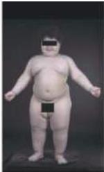
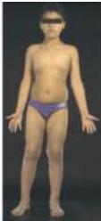

# Box C

## Obesity and the Brain

Obesity and its relationship to a broad range of diseases—including diabetes, cardiovascular disease and cancer—has become a major public health concern in most developed countries, particularly the United States.
Whereas the signature of obesity is obviously an excess of body fat, the underlying cause or causes are generally thought to lie in abnormal regulation by the brain circuits that control appetite and satiety.
This fact makes weight loss particularly difficult for many obese individuals.
Thus, understanding of the central nervous systems mechanisms that regulate food intake and metabolism are essential for developing effective strategies to combat this very serious health problem.

The brain regulates appetite and satiety (the feeling of fullness following a meal) via the neural activity that is modulated by chemical signals that are secreted into the circulation by fat storing adipose tissues throughout the body.
Since this feedback loop entails some of the central components of the visceral motor system, in addition to endocrine mechanisms via insulin and growth hormone, it is discussed here.
The peptide ghrelin is secreted by the stomach prior to feeding, presumably as a signal of hunger; adipocytes (the cells that concentrate lipid in fatty tissues) secrete leptin into the circulation following feeding, presumably as a signal for satiety.
The receptors for these peptides are concentrated in small groups of neurons in the ventrolateral and anterior hypothalamus (see Box A), which contact additional hypothalamic neurons in the arcuate region.
These grehlin- and leptin-responsive cells modulate the activity of neurons expressing the opiomelanocortin propeptide (POMC) and the subsequent secretion of $\alpha$-melanocyte secreting hormone ($\alpha$-MSH), one of the peptides encoded by the POMC transcript.
This hormone evidently regulates appetite and satiety by acting on specific receptors (particularly the melanocortin receptor subtype called MCR-4) located on additional populations of hypothalamic and brainstem neurons (particularly those in the nucleus of the solitary tract), as well as by endocrine mechanisms that remain poorly understood.

(A)

(A) A POMC knockout mouse (left) and a wild-type littermate (right).
(B) The effect of leptin treatment in a human.
At age 3 years, the subject weighed 42 kg (left); at age 7 years, following treatment, the same child weighed 32 kg (right).
(A from Yaswen et al., 1999, B from O'Rahilly et al., 2003.)

(B)

The interactions of leptin, grehlin, $\alpha$-MSH and MCR-4 were first determined in animal models.
Two recessive mutations in mice—the obese (ob/ob) and the misnamed diabetic (db/db) mice—were identified based on excessive body weight and failure to regulate food intake.
When each mutation was cloned, the mutant gene in ob mice turned out to be the gene for leptin, and the db gene that for the leptin receptor.
Mutations in the POMC (Figure A) and MCR4 genes also lead to obesity in mice.
The results of inactivation of the ghrelin gene are less clear; however, pharmacological and physiological studies associate changes in ghrelin levels with altered feeding and weight loss.
Studies in mice have thus provided a solid framework for examining the physiological mechanisms regulating food intake in humans.
Nonetheless, their relevance to morbid human obesity remained unclear until recently.

Genetic analysis of individuals in human pedigrees with extreme obesity (measured body mass indices and weight/height ratios) revealed mutations in one or more of the leptin, leptin receptor, or MCR4 genes.
As a result, these individuals have little sense of satiety after eating, and thus fail to regulate food intake based on signals other than gastric distension and pain.
How this pathophysiology is related to less extreme degrees of obesity is not yet known, but is being intensely studied because of its implications for normal weight control.

The emerging understanding of body weight regulation by hypothalamic circuits that are modulated by feedback from by hormonal signals from fat tissues has provided new ways of thinking about pharmacological therapies for weight control.
While leptin mimetics have proven generally ineffective, leptin administration in human subjects with leptin deficiencies does reduce food intake and obesity (Figure B).
Currently, there is great interest in drugs that modulate $\alpha$-MSH signaling via MCR-4.
Although no effective pharmacological therapies presently exist, there is hope that such drugs, when combined with behavioral changes in dietary practices, will effectively combat this often intractable and increasingly common health problem.

## References

O'RAHILLY, S., I.
S.
FABOQUI, G.
S.
H.
YEO AND B.
G.
CHALLIS (2003) Human obesity—lessons from monogenic disorders.
Endocrinology 144: 3757–3764.
SCHWARTZ, M.
W., S.
C.
WOODE, D.
PORTE, R.
J.
SEELY AND D.
G.
BASKIN (2000) Central nervous system control of food intake.
Nature 404: 661–671.
SAPER, C.
B., T.
C.
CHOU AND J.
K.
ELMQUIST (2002) The need to feed: Homeostatic and hedonic control of eating.
Neuron 36: 199–21.