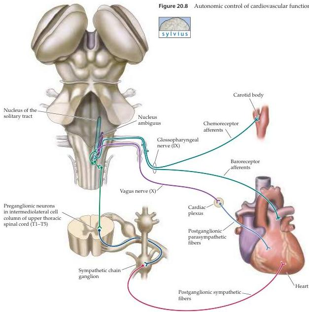

Chapter Twenty

motor pathways and, ultimately, of target smooth and cardiac muscles and other more specialized structures.
For example, a rise in blood pressure activates baroreceptors that, via the pathway illustrated in Figure 20.8, inhibit the tonic activity of sympathetic preganglionic neurons in the spinal cord.
In parallel, the pressure increase stimulates the activity of the parasympathetic preganglionic neurons in the nucleus ambiguus and the dorsal motor nucleus of the vagus that influence heart rate.
The carotid chemoreceptors also have some influence, but this is a less important drive than that stemming from the baroreceptors.

As a result of this shift in the balance of sympathetic and parasympathetic activity, the stimulatory noradrenergic effects of postganglionic sympathetic