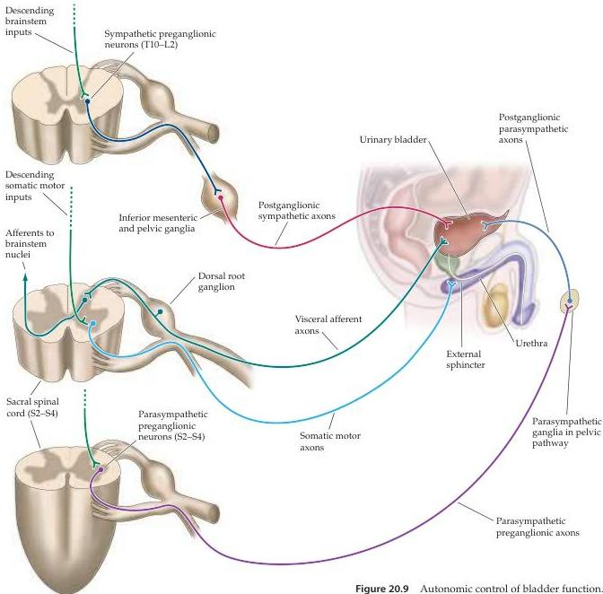

Chapter Twenty

and the sympathetic and parasympathetic divisions of the visceral motor system, which operate involuntarily.

The arrangement of afferent and efferent innervation of the bladder is shown in Figure 20.9.
The parasympathetic control of the bladder musculature, the contraction of which causes bladder emptying, originates with neurons in the sacral spinal cord segments (S2-S4) that innervate visceral motor neurons in parasympathetic ganglia in or near the bladder wall.
Mechanoreceptors in the bladder wall supply visceral afferent information to the spinal cord and to higher autonomic centers in the brainstem (primarily the nucleus of the solitary tract), which in turn project to the various central

Figure 20.9 Autonomic control of bladder function.