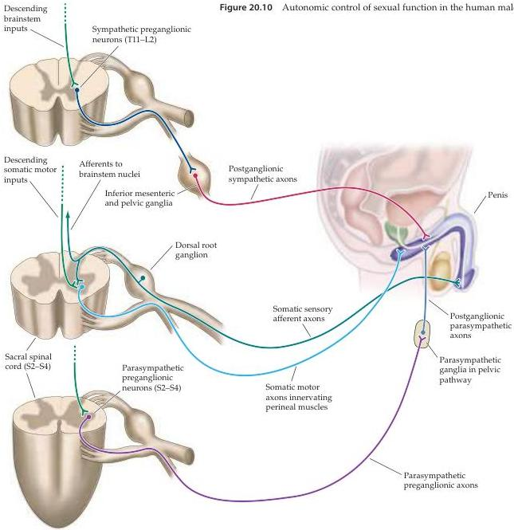

The Visceral Motor System 497

Although they remain poorly understood, these nuclei act as integrative centers for sexual responses and are also thought to be involved in more complex aspects of sexuality, such as sexual preference and gender identity (see Chapter 29).
The relevant hypothalamic nuclei receive inputs from several areas of the brain, including—as one might imagine—the cortical and subcortical structures concerned with emotion, hedonic reward, and memory (see Chapters 28 and 30).