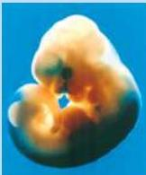

A mammalian embryo in which cells in the developing nervous system responding to the signaling molecule retinoic acid have been labeled by means of a reporter gene.
(Courtesy of Anthony-Samuel LaMantia and Elwoood Linney.)

# UNIT IV

## THE CHANGING BRAIN

21 Early Brain Development
22 Construction of Neural Circuits
23 Modification of Brain Circuits as a Result of Experience
24 Plasticity of Mature Synapses and Circuits

Although we think of ourselves as the same person throughout life, the structural and functional state of the brain changes dramatically over the human lifespan.
The initial development of the nervous system entails the generation and differentiation of neurons, the formation of axonal pathways, and the elaboration of vast numbers of synapses.
Each of these events relies upon the interplay of secreted signals, their receptors, and transcriptional regulators, as well as adhesion and recognition molecules that determine appropriate identity, positions, and connections for developing neurons.
The circuits that emerge from these processes mediate an increasingly complex array of behaviors.
Subsequent experience during postnatal life—and the activity-dependent molecular mechanisms that translate experience into changes in neuronal growth and gene expression—continues to shape neural circuits, the related behavioral repertoires, and ultimately cognitive abilities.
These changes are most pronounced during developmental windows in early life called critical periods.
Even in maturity, however, synaptic connections can be modified as new skills and memories are acquired and older ones are forgotten; even some new neurons can be generated in a few specialized regions.
Some of the mechanisms used during early development are evidently retained and adapted to mediate these ongoing changes in the mature brain.

Finally, like any other organ system, the brain is subject to disease and traumatic insults.
Some of these processes call repair mechanisms into play; however, the capacity of the mature brain for repair or regeneration is limited.
Diseases like amyotrophic lateral sclerosis, Parkinson's disease, and Alzheimer's disease all reflect pathologies of processes that normally contribute to neuronal development and to the subsequent maintenance and modification of neural circuitry.