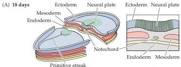
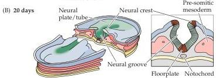
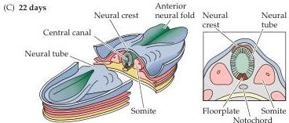
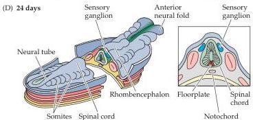

Chapter Twenty-One

Figure 21.1 Neurulation in the mammalian embryo.
On the left are dorsal views of the embryo at several different stages of early development; each boxed view on the right is a midline cross section through the embryo at the same stage.
(A) During late gastrulation and early neurulation, the notochord forms by invagination of the mesoderm in the region of the primitive streak.
The ectoderm overlying the notochord becomes defined as the neural plate.
(B) As neurulation proceeds, the neural plate begins to fold at the midline (adjacent to the notochord), forming the neural groove and ultimately the neural tube.
The neural plate immediately above the notochord differentiates into the floorplate, whereas the neural crest emerges at the lateral margins of the neural plate (farthest from the notochord).
(C) Once the edges of the neural plate meet in the midline, the neural tube is complete.
The mesoderm adjacent to the tube then thickens and subdivides into structures called somites—the precursors of the axial musculature and skeleton.
(D) As development continues, the neural tube adjacent to the somites becomes the rudimentary spinal cord, and the neural crest gives rise to sensory and autonomic ganglia (the major elements of the peripheral nervous system).
Finally, the anterior ends of the neural plate (anterior neural folds) grow together at the midline and continue to expand, eventually giving rise to the brain.

In addition to specifying the basic topography of the embryo and determining the position of the nervous system, the notochord is required for subsequent neural differentiation (see Figure 21.1).
Thus, the notochord (along with the primitive pit) sends inductive signals to the overlying ectoderm that cause a subset of neuroectodermal cells to differentiate into neural precursor cells.
During this process, called neurulation, the midline ectoderm that contains these cells thickens into a distinct columnar epithelium called the neural plate.
The lateral margins of the neural plate then fold inward, eventually transforming the neural plate into a tube.
This neural tube subsequently gives rise to the brain and spinal cord.

The progenitor cells of the neural tube are known as neural precursor cells.
These precursors are dividing neural stem cells (Box A) that produce