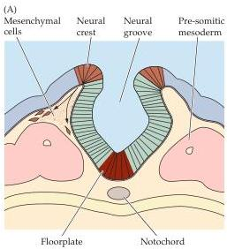
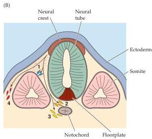

Figure 21.2 The neural crest.
(A) Cross section through a developing mammalian embryo at a stage similar to that in Figure 21.1B.
The neural crest cells are established based on their position at the boundary of the embryonic epidermis and neuroectoderm.
Arrows indicate the initial migratory route of undifferentiated neural crest cells.
(B) Four distinct migratory paths lead to differentiation of neural crest cells into specific cell types and structures.
Cells that follow pathways (1) and (2) give rise to sensory and autonomic ganglia, respectively.
The precursors of adrenal neurosecretory cells migrate along pathway (3) and eventually aggregate around the dorsal portion of the kidney.
Cells destined to become non-neural tissues (for example, melanocytes) migrate along pathway (4).
Each pathway permits the migrating cells to interact with different kinds of cellular environments, from which they receive inductive signals (see Figure 21.11).
(After Sanes, 1988.)

more precursors, all with the capacity to give rise to neurons, astrocytes, and oligodendroglial cells.
Eventually, subsets of these neural precursor cells will generate non-dividing neuroblasts that differentiate into neurons.
Not all cells in the neural tube, however, are neural precursors.
The cells at the ventral midline of the neural tube differentiate into a special strip of epithelial-like cells called the floorplate (reflecting their proximity to the notochord), which provides molecular signals to specify the neuroblast cells.
The position of the floorplate at the ventral midline defines the dorsoventral polarity of the neural tube and further influences the differentiation of neural precursor cells.
Inductive signals from both the notochord and floorplate lead to differentiation of cells in the ventral portion of the neural tube that eventually give rise to spinal and hindbrain motor neurons (which are thus closest to the ventral midline).
Precursor cells farther away from the ventral midline give rise to sensory relay neurons within the spinal cord and hindbrain.

At the most dorsal limit of the neural tube, a third population of cells emerges in the region where the edges of the folded neural plate join together.
Because of their location, this set of precursors is called the neural crest (Figure 21.2).
The neural crest cells migrate away from the neural tube through loosely packed mesenchymal cells that fill the spaces between the neural tube, embryonic epidermis, and somites.
Subsets of neural crest cells follow specific pathways that expose them to additional inductive signals that influence their differentiation.
As a result, neural crest cells give rise to a variety of progeny, including the neurons and glia of the sensory and visceral motor (autonomic) ganglia, the neurosecretory cells of the adrenal gland, and the neurons of the enteric nervous system.
Neural crest cells also contribute to variety of non-neural structures such as pigment cells, cartilage, and bone, particularly in the face and skull.

# The Molecular Basis of Neural Induction

The essential consequence of gastrulation and neurulation for the development of the nervous system is the emergence of a population of neural precursors from a subset of ectodermal cells.
Through a variety of experimental manipulations, primarily involving extirpation or transplantation of differ