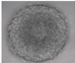
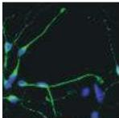
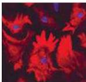
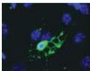

Chapter Twenty-One

# Box A

## Stem Cells: Promise and Perils

One of the most highly publicized issues in biology over the past several years has been the use of stem cells as a possible way of treating a variety of neurodegenerative conditions, including Parkinson's, Huntington's, and Alzheimer's diseases.
Amidst the social, political, and ethical debate set off by the promise of stem cell therapies, an issue that tends to get lost is what, exactly, is a stem cell?

Neural stem cells are an example of a broader class of stem cells called somatic stem cells.
These cells are found in various tissues, either during development or in the adult.
All somatic stem cells share two fundamental characteristics: they are self-renewing, and upon terminal division and differentiation they can give rise to the full range of cell classes within the relevant tissue.

Thus, a neural stem cell can give rise to another neural stem cell or to any of the main cell classes found in the central and peripheral nervous system (inhibitory and excitatory neurons, astrocytes, and oligodendrocytes; Figure A).
A neural stem cell is therefore distinct from a progenitor cell, which is incapable of continuing self-renewal and usually has the capacity to give rise to only one class of differentiated progeny.
An oligodendroglial progenitor, for example, continues to give rise to oligodendrocytes until its mitotic capacity is exhausted; a neural stem cell, in contrast, can generate more stem cells as well as a full range of differentiated neural cell classes, presumably indefinitely.

Neural stem cells, and indeed all classes of somatic stem cells, are distinct from embryonic stem cells.
Embryonic stem cells (also known as ES cells) are derived from pre-gastrula embryos.
ES cells also have the potential for infinite self-renewal and can give rise to all tissue and cell types throughout the organism including germ cells that can generate gametes (recall that somatic stem cells can only generate tissue specific cell types).

(A)

(i)

(ii)

(iii)

(A) A single "neurosphere" consisting of clonally related neural stem cells from the adult forebrain is shown at top.
Neurosphere-derived stem cells can differentiate to produce (i) GABAergic neurons, (ii) astrocytes, and (iii) oligodendroglia.

There is some debate about the capacity of somatic stem cells to assume embryonic stem cell properties.
Some experiments with hematopoetic and neural stem cells indicate that these cells can give rise to appropriately differentiated cells in other tissues; however, some of these experiments have not been replicated.

The ultimate therapeutic promise of stem cells—neural or other types—is their ability to generate newly differentiated cell classes to replace those that may have been lost due to disease or injury.
Such therapies have been imagined for some forms of diabetes (replacement of islet cells that secrete insulin) and some hematopoetic diseases.
In the nervous system, stem cell therapies have been suggested for replacement of dopaminergic cells lost to Parkinson's disease and replacing lost neurons in other degenerative disorders.

While intriguing, this projected use of stem cell technology raises some significant perils.
These include insuring the controlled division of stem cells when introduced into mature tissue, and identifying the appropriate molecular instructions to achieve differentiation of the desired cell class.
Clearly, the latter challenge will need to be met with a fuller understanding of the signaling and transcriptional regulatory steps used during development to guide differentiation of relevant neuron classes in the embryo.

At present, there is no clinically validated use of stem cells for human therapeutic applications in the nervous system.
Nevertheless, some promising work in mice and other experimental animals indicates that both somatic and ES cells can acquire distinct identities if given appropriate instructions in vitro (i.e., prior to introduction into the host), and if delivered into a supportive host environment.
For example, ES cells grown in the presence of platelet-derived growth factor, which biases progenitors toward glial fates, can generate oligodendroglial cells that can myelinate axons in myelin-deficient rats.
Similarly, ES cells pretreated with retinoic acid matured into motor neurons when introduced into the