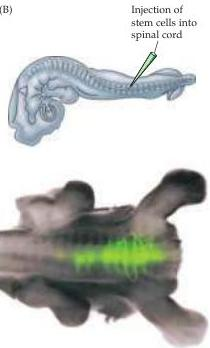
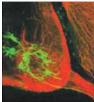

Early Brain Development 505

(B)
Developing spinal cord (Figure B).
While such experiments suggest that a combination of proper instruction and correct placement can lead to appropriate differentiation, there are still many issues to be resolved before the promise of stem cells for nervous system repair becomes a reality.

(B) Top left: Schematic of the injection of fluorescently labeled embryonic stem (ES) cells into the spinal cord of a host chicken embryo.
Bottom left: ES cells integrate into the host spinal cord and apparently extend axons.
Top right: the progeny of the grafted ES cells are seen in the ventral horn of the spinal cord.
They have motor neuron-like morphologies, and their axons extend into the ventral root.
(From Wichterle et al., 2002.)

# References

BRAZELTON, T.
R., F.
M.
V.
ROSSI, G.
I.
KESHET AND H.
M.
BLAU (2000) From marrow to brain: Expression of neuronal phenotypes in adult mice.
Science 290: 1776-1779.
BRUSTLE, O.
AND 7 OTHERS (1999) Embryonic stem cell derived glial precursors: A source of myelinating transplants.
Science 285: 754-756.
CASTRO, R.
F., K.
A.
JACKSON, M.
A.
GOODELL, C.
S.
ROBERTSON, H.
LIU AND H.
D.
SHINE (2002) Failure of bone marrow cells to transdifferentiate into neural cells in vivo.
Science 297: 1299.
MEZey, E., K.
J.
CHANDROSS, G.
HARTA, R.
A.
MAKI AND S.
R.
MCKERCHER (2000) Turning blood into brain: Cells bearing neuronal antigens generated in vivo from bone marrow.
Science 290: 1779-1782.
SEABERG, R.
M.
AND D.
VAN DER KUOY.
(2003) Stem and progenitor cells: The premature desertion of rigorous definition.
TINS 26: 125-131.
WICHTERLE, H., I.
LIEBERAM, J.
A.
PORTER AND T.
M.
JESSELL (2002) Directed differentiation of embryonic stem cells into motor neurons.
Cell 110: 385-397.

ent portions of developing embryos, embryologists recognized early on that this process depends on signals arising from cells in the primitive pit and notochord.
Because a wide variety of chemical agents and physical manipulations are able to mimic some of the effects of these endogenous signals, their nature remained a mystery for several decades.
It is now clear that the generation of cell identity—of which neural induction is but one mechanism—results from the spatial and temporal control of different sets of genes by endogenous signaling molecules (Figure 21.3).
These inducing signals—including those from the primitive pit and notochord—are, not surprisingly, molecules that modulate gene expression.
The increasingly sophisticated effort to understand exactly how these inductive signals work has therefore focused on molecules that can modify patterns of gene expression.

One of the first of these inductive signals to be identified was retinoic acid, a derivative of vitamin A and a member of the steroid/thyroid superfamily of hormones (Figure 21.3 and Box B).
Retinoic acid activates a unique class of transcription factors—the retinoid receptors—that modulate the expression of a number of target genes.
Peptide hormones provide another class of inductive signals, including those that belong to the fibroblast growth factor (FGF) and transforming growth factor (TGF) families.
Within the TGF family, the bone morphogenetic proteins (BMPs) are particularly important for a variety of events in neural induction and differentiation; these will be dis