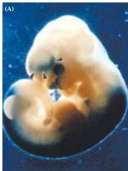
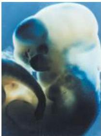
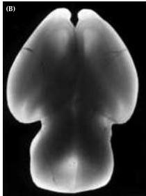
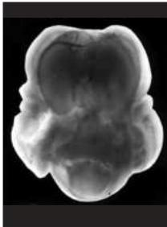

Chapter Twenty-One

# Box B

## Retinoic Acid: Teratogen and Inductive Signal

In the early 1930s, investigators noticed that vitamin A deficiency during pregnancy in animals led to a variety of fetal malformations.
The most severe abnormalities affected the developing brain, which was often grossly malformed.
At about the same time, experimental studies yielded the surprising finding that excess vitamin A caused similar defects.
These observations suggested that a family of compounds—metabolic precursors or derivatives of vitamin A called retinoids—are teratogenic.
(Teratogenesis is the term for birth defects induced by exogenous agents.) The retinoids include the alcohol form of vitamin A (retinol), the aldehyde form (retinal), and the acid form (retinoic acid).
Subsequent experiments in animals confirmed that other retinoids produce birth defects similar to those generated by too much—or too little—vitamin A.
The disastrous consequences of exposure to exogenous retinoids during human pregnancy were underscored in the early 1980s when the drug Accutane® (the trade name for isoretinoin, or 13-cis-retinoic acid) was introduced as a treatment for severe acne.
Women who took this drug during pregnancy had an increased number of spontaneous abortions and children born with a range of birth defects.
Despite the importance of these several findings, the reasons for the adverse effects of retinoids on fetal development remained obscure well into the late twentieth century.

An important insight into teratogenic potential of retinoids came when embryologists working on limb development in chicks found that retinoic acid mimics the inductive ability of tissues in the limb bud.
Still the mystery remained as to just what retinoic acid (or its absence) was doing to influence or compromise development.
An important answer came in the mid-1980s, when the receptors for retinoic acid were discovered.
These receptors are members of the steroid/thyroid hormone receptor superfamily; when they bind retinoic acid or similar ligands, the receptors act as transcription factors to activate specific genes.
Furthermore, careful biochemical analysis showed that retinoic acid was synthetic.

(A) At left, retinoic acid activates gene expression in a subset of cells in the normal developing forebrain of a mid-gestation mouse embryo (blue areas indicate β-galactosidase reaction product, an indicator of gene expression in this experiment).
At right, after maternal ingestion of a small quantity of retinoic acid (0.00025 mg/g of maternal weight), gene expression is ectopically activated throughout the forebrain.
(B) At left, the brain of a normal mouse at term; at right, the grossly abnormal brain of a mouse whose mother ingested this same amount of retinoic acid at mid-gestation.
(A from Anchan et al., 1997; B from Linney and LaMantia, 1994.)

