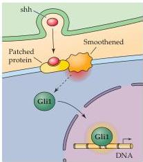
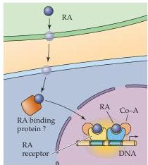
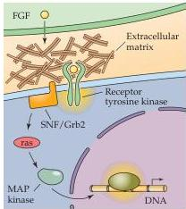
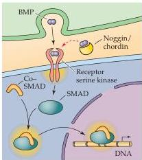
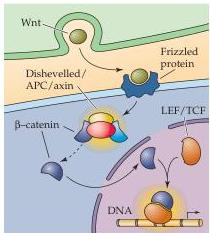

Chapter Twenty-One

(A) Sonic Hedgehog (shh)

(B) Retinoic acid (RA)

(C) Fibroblast growth factor (FGF)

(D) Bone morphogenetic protein (BMP)

(E) Wnt
Figure 21.3 Major inductive signaling pathways in vertebrate embryos.
Schematics of ligands, receptors, and primary intracellular signaling molecules for retinoic acid (RA); members of the FGF and TGF-  $\beta$  superfamily of peptide hormones; sonic hedgehog (shh); and the Wnt family of signals.
Each of these pathways contributes to the initial establishment of the neural ectoderm, as well as to the subsequent differentiation of distinct classes of neurons and glia throughout the brain.

Some inductive signals use more indirect signaling routes.
For example, the transduction of signals via sonic hedgehog depends on the cooperative binding of two surface receptors followed by internalization of the receptor.
The internalized complexes influence nuclear translocation of transcription factors (including Gli1) and subsequent modulation of gene expression.
The transduction of Wnt signals has a similarly circuitous route, leading ultimately to the nucleus.
Wnt receptors, including a family of proteins with the fanciful name "frizzled," initiate a cascade of events after Wnt binding that leads to the degradation of a cytoplasmic protein complex that normally prevents the translocation of  $\beta$ -catenin from the cytoplasm to the nucleus.
Once freed from this inhibition,  $\beta$ -catenin enters the nucleus and influences expression of a number of downstream genes.

A particularly distinctive aspect neural induction is the mechanism by which the BMPs influence neural differentiation (see Figure 21.3).
As the name suggests, these peptide hormones, which are members of the TGF-  $\beta$  family, elicit osteogenesis from mesodermal cells.
If ectodermal cells are exposed to BMPs, they assume an epidermal fate.
But how then does the