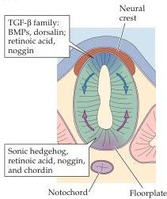
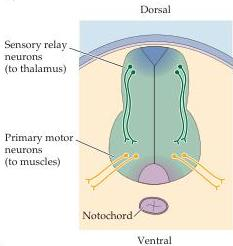
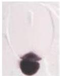
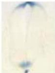

Early Brain Development

ectoderm manage to become neuralized, given the fact that BMPs are produced by the somites and surrounding mesodermal tissue? All of these structures are in position to signal to the neuroectoderm, and therefore to convert it to epidermis.
This fate is evidently avoided in the neural plate by the local activity of other inductive signaling molecules such as noggin and chordin—two members of a broad class of endogenous antagonists that modulate signaling via the TGF- $\beta$  family (including that of the BMPs).
Both of these molecules bind directly to the BMPs and thus prevent their binding to BMP receptors.
In this way, the neuroectoderm is "rescued" from becoming epidermis.
Such negative regulation has reinforced the speculation that becoming a neuron is actually the "default" fate for embryonic ectodermal cells.

Some of these molecular signals have been implicated in determining the fates of specific classes of cells in the developing nervous system act after the initial differentiation of the neural plate, tube and neural crest (Figure 21.4).
As mentioned above, sonic hedgehog (shh) is essential for the differentiation of motor neurons in the ventral spinal cord (Figure 21.4D), as well as some classes of neurons and glia in the forebrain; TGF-  $\beta$  family signals (including the BMPs) are important for the establishment of dorsal cells in the spinal cord—as well as the neural crest—and can influence other neuron classes in dorsal positions throughout the forebrain.
The Wnt family of signals also is essential for the differentiation of neural crest, cerebellar granule cells, and

(A)

(D)

(B) ssh

(C) noggin
Figure 21.4 Localized inductive signals influence axes and cellular identity in the developing neural tube.
(A) Local signals associated with the dorsal-ventral axis.
This distribution of signaling molecules is seen in those regions of the neural tube that give rise to the spinal cord and hindbrain.
(B) Expression of shh mRNA is limited to the notochord and floorplate of the developing spinal cord.
This localized expression is thought to establish a gradient of secreted shh peptide extending throughout most of the ventral spinal cord.
(C) The endogenous TGF-  $\beta$  antagonist noggin is expressed both in the notochord and in the dorsal medial neural tube (a region referred to as the roofplate).
(D) The identity of motor (yellow) and sensory relay neurons (green) in the ventral versus the dorsal spinal cord, respectively, is thought to reflect the graded local activity of signals like shh, noggin, and others.
This impression has been confirmed in studies that disrupt the balance of local inductive signals.