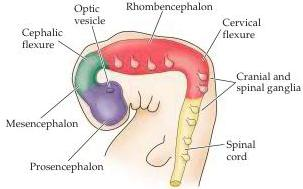
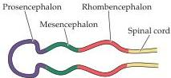
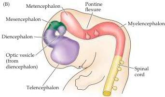
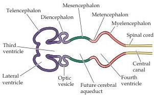
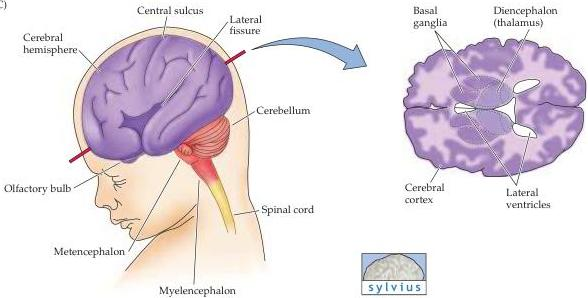

Early Brain Development

(A)

(B)

(C)

stricts or enlarges the lumen enclosed by the developing neural tube.
These lumenal spaces eventually become the ventricles of the mature brain (Figure 21.5B; see also Appendix B).

Once the primitive brain regions are established in this way, they undergo at least two more rounds of partitioning, each of which produces additional regions in the adult (Figure 21.5C).
Thus, the lateral aspects of the rostral prosencephalon forms the telencephalon.
The two bilaterally symmetric telencephalic vesicles include dorsal and ventral territories.
The dorsal terri