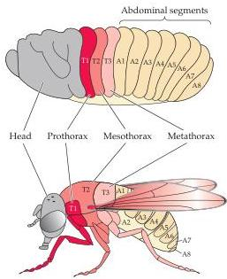
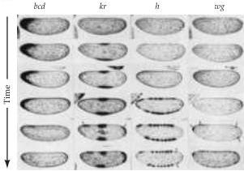
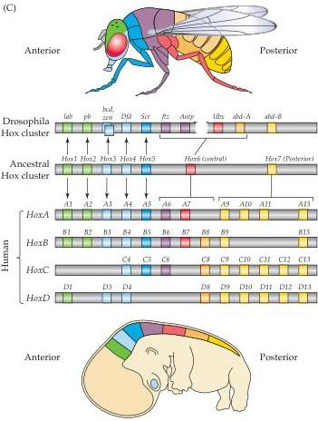

(A)

(B)

that the process of segmentation—used by all animal embryos at the earliest stages of development to establish regional identity in the body—might also establish regional identity in the developing brain.
Enthusiasm for this hypothesis was stimulated by observations of the development of the body plan of the fruit fly Drosophila.
In the fly, early expression of a class of genes called homeotic or homeobox genes (Box C) guides the differentiation of the embryo into distinct segments that give rise to the head, thorax, and abdomen (Figure 21.6).
These genes code for DNA-binding proteins that can modulate the expression of other genes.
Similar homeobox genes in mammals (referred to as Hox genes) have also been identified.
In some cases their pattern of expression coincides with, or even precedes, the formation of morphological features such as the various bends, folds, and constrictions that signify the progressive regionalization of the developing neural tube, particularly in the hindbrain and spinal cord (Figure 21.6 and Box D).

(C)
Figure 21.6 Sequential gene expression divides the embryo into regions and segments.
(A) The relationship of the embryonic segments in the Drosophila larva, defined by sequential gene expression, to the body plan of the mature fruit fly.
(B) Temporal pattern of expression of four genes that influence the establishment of the body plan in Drosophila.
A series of sections through the anterior-posterior midline of the embryo are shown from early to later stages of development (top to bottom in each row).
Initially, expression of the gene bicoid (bcd) helps define the anterior pole of the embryo.
Next, krippel  $(kr)$  is expressed in the middle and then at the posterior end of the embryo, defining the anterior-posterior axis.
Then hairy  $(h)$  is expressed, which helps to delineate the domains that will eventually form the mature segmented body of the fly.
Finally, the wingless  $(wg)$  gene is expressed, further refining the organization of individual segments.
(C) Parallels between Drosophila segmental genes (the inferred "ancestral" homeobox genes from which invertebrate and vertebrate segmental genes evolved) and human Hox genes.
Human Hox genes have apparently been duplicated twice, leading to four independent groups, each on a distinct human chromosome.
The anterior-to-posterior pattern of Hox gene expression in both flies and mammals (including humans) follows the  $3^{\prime}$ -to- $5^{\prime}$  orientation of these genes on their respective chromosomes.
(A after Gilbert, 1994, and Lawrence, 1992; B from Ingham, 1988; C after Veraksa and Mc Ginnis, 2000.)