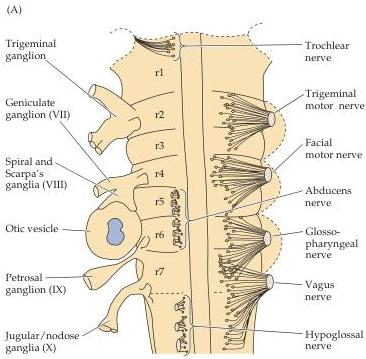
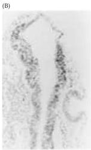
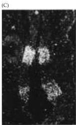

Chapter Twenty-One

# Box D

## Rhombomeres

An interesting parallel between early embryonic segmentation and early brain development was noticed around the turn of the nineteenth century.
Several embryologists reported repeating units in the early neural plate and neural tube, which they called neuromeres.
In the late 1980s, A.
Lumsden, R.
Keynes, and their colleagues, as well as R.
Krumlauf, R.
Wilkinson, and colleagues, noticed further that combinations of homeobox (Hox) and related genes (see Box C) are expressed in banded patterns in the developing chick nervous system, especially in the hindbrain (the common name for the rhombencephalon and its derivatives).
These expression domains defined rhombomeres, which in the chick (as well as in most mammals), are a series of seven transient bulges in the developing rhombencephalon corresponding to the neuromeres described earlier.
Rhombomeres are sites of differential cell proliferation (cells at rhombomere boundaries divide faster than cells in the rest of the rhombomere), differential cell mobility (cells from any one rhombomere cannot easily cross into adjacent rhombomeres), and differential cell adhesion (cells prefer to stick to those of their own rhombomere).

Later in development, the pattern of axon outgrowth from the cranial motor nerves also correlates with the earlier rhombomeric pattern.
Cranial motor nerves (see Appendix A) originate either from a single rhombomere or from specific pairs of neighboring rhombomeres (transplantation experiments indicate that rhombomeres are in fact specified in pairs).
Thus, Hox gene expression probably represents an early step in the formation of the cranial nerve.

Rhombomeres in the developing chicken hindbrain and their relationship to the differentiation of the cranial nerves.
(A) Diagram of the chick hindbrain, indicating the position of the cranial ganglia and nerves and their rhombomeric origin (rhombomeres denoted as r1 to r7).
(B) Section through early chicken hindbrain, showing bulges that will eventually become rhombomeres (in this example, r3 to r5).
(C) Differential patterns of transcription factor expression (in this case, $krx20$, a Hox-like gene) define rhombomeres at early stages of development, well before the cranial nerves that will eventually emerge from them are apparent.
(A courtesy of Andrew Lumsden; B,C from Wilkinson and Krumlauf, 1990.)

