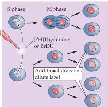
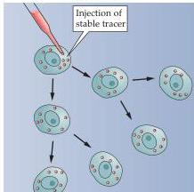
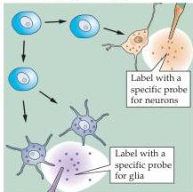

Early Brain Development 517

# Box E

## Neurogenesis and Neuronal Birthdating

The process by which neurons are generated is generally referred to as neurogenesis.
The time at which neurogenesis occurs for any particular neuron is called its neuronal “birthdate.” At some point in development, stem cells—the dividing cells that populate the proliferative zones of the developing brain—undergo asymmetrical divisions that produce both another stem cell and a neuronal precursor (called a neuroblast) that will never again undergo cell division.
Because neurons are generally unable to reenter the cell cycle once they have left it, the point at which a neuronal precursor leaves the cycle defines the birthdate of the resulting neuron.

In animals with extraordinarily simple nervous systems, such as the worm *Caenorhabditis elegans*, it is possible to directly monitor in a microscope each embryonic stem cell as it undergoes its characteristic series of cell divisions, and to thereby determine when a specific neuron is born.
In the vastly more complex vertebrate brain, however, this approach is not feasible.
Instead, neurobiologists rely on the characteristics of the cell cycle itself to label cells according to their date of birth.
When cells are actively replicating DNA, they take up nucleotides—the building blocks of DNA (see Figure 21.6).
Cell birthdating studies use a labeled nucleotide that can be incorporated only into newly synthesized DNA—usually tritium-labeled thymidine or a chemically distinctive analog of thymidine (the DNA-specific nucleotide) such as bromodeoxyuridine (BrDU)—at a known time in the organism’s developmental history.
All stem cells that are actively synthesizing DNA incorporate the labeled tag and pass it on to their descendants.
Because the labeled probe is only available for minutes to hours after being injected, if a stem cell continues to divide, the levels of the labeled probe in the cell’s DNA are quickly diluted.
However, if a cell undergoes only a single division after incorporating the label and produces a postmitotic neuroblast, that neuron retains high levels of the labeled DNA indefinitely.
Once the animal has matured, histological sections prepared from the brain show the labeled neurons.
The most heavily labeled cells are those that incorporated the tag just before their final division; they are therefore said to have been “born” at the time of injection.

One of the earliest insights obtained from this approach was that the layers of the cerebral cortex develop in an “inside-out” fashion (see Figure 21.7).
In certain mutant mice, such as *reeler* (see Box B in Chapter 18), birthdating studies show that the oldest cells end up erroneously in the most superficial layers and the most recently generated cells in the deepest as a result of defective migration.
Although neuronal birthdates do not, in themselves, tell the lineage of cells, or when they acquire specific phenotypic or molecular features, they mark a major transition in the genetic programs that dictate when and how nerve cells differentiate.

## References

ANGEVINE, J.
B.
JR.
AND R.
L.
SIDMAN (1961) Autoradiographic study of cell migration during histogenesis of the cerebral cortex in the mouse.
Nature 192: 766–768.

CAVINESS, V.
S.
JR.
AND R.
L.
SIDMAN (1973) Time of origin of corresponding cell classes in the cerebral cortex of normal and *reeler* mutant mice: An autoradiographic analysis.
J.
Comp.
Neurol.
148: 141–151.

GRATZNER, H.
G.
(1982) Monoclonal antibody to 5-bromo and 5-iododeoxyuridine.
A new reagent for the detection of DNA replication.
Science 218: 474–475.

MILLER, M.
W.
AND R.
S.
NOWAKOWSKI (1988) Use of bromodeoxyuridine immunohistochemistry to examine the proliferation, migration, and time of origin of cells in the central nervous system.
Brain Res.
457: 44–52.

Birthdate

Lineage

Molecular "mapping"