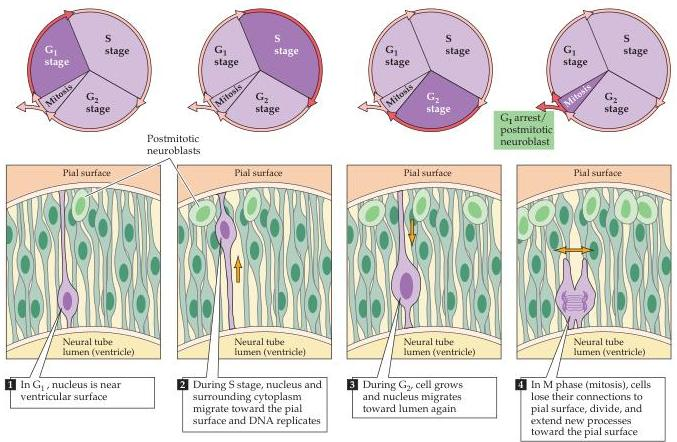

Chapter Twenty-One

Figure 21.7 Dividing precursor cells in the vertebrate neuroepithelium (neural plate and neural tube stages) are attached both to the pial (outside) surface of the neural tube and to its ventricular (lumenal) surface.
The nucleus of the cell translocates between these two limits within a narrow cylinder of cytoplasm.
When cells are closest to the outer surface of the neural tube, they enter a phase of DNA synthesis (the S stage); after the nucleus moves back to the ventricular surface (the  $G_{2}$  stage), the precursor cells lose their connection to the outer surface and enter mitosis (the M stage).
When mitosis is complete, the two daughter cells extend processes back to the outer surface of the neural tube, and the new precursor cells enter a resting  $(G_{1})$  phase of the cell cycle.
At some point a precursor cell generates either another stem cell that will go on dividing and a daughter cell—a neuroblast—that will not divide further, or two postmitotic daughter cells.

neurons are arranged into layered structures (hippocampus, cerebellum, superior colliculus) there is a systematic relationship between the layers and the time of cell origin.
Thus, each layer consists of a cohort of cells generated during a specific developmental period.
The implication of this phenomenon is that common periods of neurogenesis are important for the development of the cell types and connections that characterize each layer.

# The Generation of Neuronal Diversity

The neuronal precursor cells in the ventricular zone of the embryonic brain look and act more or less the same.
Yet these precursors ultimately give rise to postmitotic cells that are enormously diverse in form and function.
The spinal cord, cerebellum, cerebral cortex, and subcortical nuclei (including the basal ganglia and thalamus) each contain several neuronal cell types distinguished by morphology, neurotransmitter content, cell surface molecules, and the types of synapses they make and receive.
On an even more basic level, the stem cells of the ventricular zone produce both neurons and glia—cells with markedly different properties and functions.
How and when are these different cell types determined?

The bulk of the evidence favors the view that neuronal differentiation is based primarily on local cell-cell interactions followed by distinct histories of transcriptional regulation via a "code" of transcription factors expressed in each cell (Figure 21.9).
Historically, most experimental approaches to this issue have relied on transplantation strategies, such as moving bits of a par