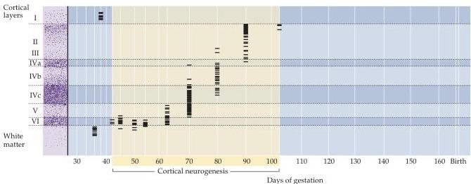

Early Brain Development 519

ticular brain region to a different location in the brain of a host animal to determine whether the transplanted cells acquire the host phenotype or retain their original fate during subsequent development.
In general, when very young precursor cells are transplanted, they tend to acquire the host phenotype.
Transplanted cells at increasingly older ages, however, usually retain the original phenotype.

The use of genetic approaches, particularly in simple, so-called "model" organisms such as fruit flies and the worm *Caenorhabditis elegans*, has made clear the essential role of local cell–cell interactions, and has indicated some of the molecules that mediate these processes in neural fate determination.
In the fruit fly eye, the position and identity of a variety of photoreceptor cells with distinct visual functions relies upon signaling mediated by cell surface ligands on one class of cells and specific receptor kinases on adjacent cells (Figure 21.10).
In *C.
elegans*, the determination of midline neurons reflects their lineage, the proper functioning of genes involved in cell–cell signaling, and whether subsets of precursors survive or die during programmed cell death, or apoptosis.

Similar local interactions have been invoked to explain differentiation of a number of neuronal and glial classes in the developing vertebrate brain.
Perhaps not surprisingly, many of the signaling molecules that are essential for initial steps of neural induction and regionalization—retinoic acid, the FGFs, BMPs, shh, and Wnts—all influence the genesis of specific classes of neurons and glia via local cell–cell interactions (see Figure 21.9).
Some of the additional signaling molecules that contribute to these processes in the vertebrate brain include the notch family of cell surface ligands and their receptors, the delta family which tend to maintain precursors in a less differentiated state.
Among the targets of these signals, a subset of transcription factor genes known as the bHLH genes (named for a shared basic *helix-loop-helix* amino acid motif that defines the DNA binding domain) has emerged as central to subsequent differentiation of distinct neural or glial fates.

These molecular details provide an outline of how general cell classes are established; however, there is presently no clear and complete explanation for how any specific neuronal class achieves its identity.
This gap in knowledge presents a problem in using neural stem cells to generate replacements for specific cell classes lost in neurodegenerative diseases or after brain injury (see Box A).

Figure 21.8 Generation of cortical neurons during the gestation of a rhesus monkey (a span of about 165 days).
The final cell divisions of the neuronal precursors, determined by maximal incorporation of radioactive thymidine administered to the pregnant mother (see Box E), occur primarily during the first half of pregnancy and are complete on or about embryonic day 105.
Each short horizontal line represents the position of a neuron heavily labeled by maternal injection of radiolabeled thymidine at the time indicated by the corresponding vertical line.
The numerals on the left designate the cortical layers.
The earliest generated cells are found in a transient layer called the subplate (a few of these cells survive in the white matter) and in layer I (the Cajal-Retzius cells).
(After Rakic, 1974.)