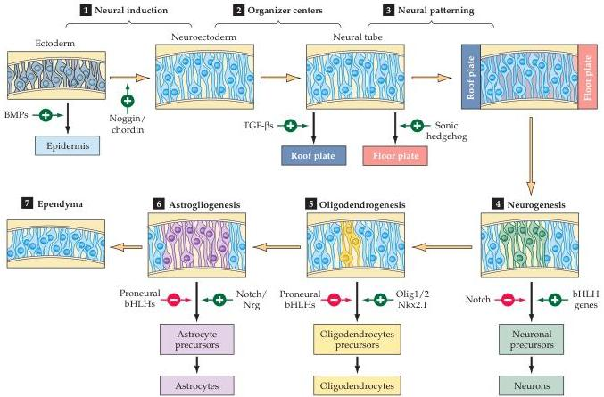

Figure 21.9 Essential molecular and cellular mechanisms that guide neuronal and glial differentiation in the neural ectoderm.
(1-3) The steps by which ectoderm acquires its identity as neural ectoderm.
Generation of neural precursors, or stem cells, relies first on the balance of BMP and its endogenous antagonists like noggin and chordin in the developing embryo.
Next, local sources of inductive signals, including TFG-  $\beta$  family members and sonic hedgehog, establish gradients that influence subsequent neural precursor identities, as well as identifying local "organizers" (such as the floorplate and roofplate) that define the cellular identity of the inductive signaling centers.
(4-7) Steps thought to define neurons, oligodendroglia, and astrocytes from multipotent neuronal precursors.
Balanced signaling activity of notch and transcriptional control of the bHLH proneural genes (named based on their ability to bias neural progenitor cells toward a differentiate neural fate) influence neurogenesis.
Similarly, antagonistic transcriptional regulation via either the bHLH genes or three additional transcription factors, Olig1, Olig2, and Nkx2.2, influence the generation of oligodendroglia.
Continued antagonism between bHLH genes, notch signaling, and the signal molecule neureglin (Nrg) is thought to influence the generation of mature astrocytes.
Finally, in the adult brain, cells adjacent to the ventricles (which apparently have avoided becoming differentiated) remain as ependymal cells.
These may included a subpopulation of neural stem cells (see Box A).
(After Kintner, 2002.)

# Neuronal Migration

The cellular positioning that constrains local signaling depends on migration of postmitotic neuroblasts in the fetal brain.
Migration is a ubiquitous feature of development that brings cells into appropriate spatial relationships.
In the nervous system, migration during development brings different classes of neurons together so that they can interact appropriately.
The final location of a postmitotic nerve cell is presumably especially critical, since neural function depends on precise connections made by neurons and their targets.
In short, the developing presynaptic and postsynaptic elements must be in the right place at the right time.

After their final mitosis in the ventricular zone, most neuroblasts migrate substantial distances.
For neurons of the central nervous system, this migration remains within the limits of the neural tube.
However, neurons of the peripheral nervous system, which come from the neural crest, arise from cells that have often journeyed a considerable distance through several embryonic environments (see Figure 21.2).
Even within the central nervous system, the significant distances traversed are obvious in large animals like primates.
To form the cerebral cortex, for example, neurons must sometimes travel several millimeters from the ventricular zone to the pial surface.

A good deal is now known about the mechanics of how neurons move from their birthplace to their final destina