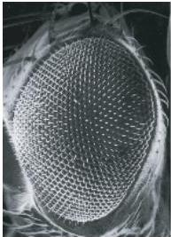
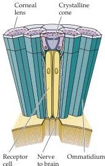
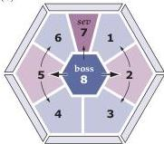

Early Brain Development

(A)

(B)

tion.
Depending on the area of the developing nervous system in which they originate, migrating neurons follow one of two strategies.
Neural crest cells are largely guided along distinct migratory pathways by specialized adhesion molecules in the extracellular matrix or by molecules on the surfaces of cells in the embryonic periphery (see Figure 21.2).
At different developmental stages, similar molecules are probably used to guide axonal outgrowth (see Chapter 22).
In contrast, neurons in many regions, including the cerebral cortex, cerebellum, hippocampus, and spinal cord, are guided to their final destinations by crawling along a particular type of glial cell, called radial glia, which act as cellular guides (Figure 21.11).

Histological observations of embryonic brains made by Wilhelm His and Ramon y Cajal during the nineteenth and early twentieth centuries suggested that neuroblasts crawled along glial guides to their final locations (Figure 21.11A).
These observations were supported by analyses of electron microscopic images of fixed tissue in the 1960s and 1970s (Figure 21.11B,C), which fit well with the orderly relationship between birthdates and final position of distinct cell types in the cerebellum and cerebral cortex (see Figure 21.7 and Box E).
Subsequently, innovations in cell culture techniques and light microscopy made it possible to observe the process of migration directly.
When radial glial cells and immature neurons are isolated from the developing cerebellum or cerebral cortex and mixed together in vitro, the neurons attach to the glial cells, assume the characteristic shape of migrating cells seen in vivo, and begin moving along the glial processes.
Indeed, the membrane constituents of glial cells, when coated onto thin glass fibers, support this sort of normal migration.
Several cell surface adhesion molecules, extracellular matrix adhesion molecules, and associated signal transduction molecules apparently mediate this process.
Many of these molecules are also essential for subsequent steps in neural development, such as axon growth and guidance (see Chapter 22).
Although in many regions of the brain—particularly those that give rise to nuclear cell groups—neurons migrate without the benefit of glial guides (Box F) migration along radial glial fibers is always seen in regions where cells are organized into layers, such as the cerebral cortex, hippocampus, and cerebellum.
Both neuropathological

(C)
Figure 21.10 Development of the compound eye of the fruit fly Drosophila provides an example of how cell-cell interactions can determine cell fate.
(A) Scanning electron micrograph of the eye in Drosophila.
(B) Diagram of the structure of the fly eye.
The eye consists of an array of identical ommatidia, each comprising an array of eight photoreceptors.
(C) Arrangement of photoreceptors within each ommatidium and the cell-cell signaling that determines their fate.
A membrane-bound ligand on R8 (the boss gene product) binds to a receptor (encoded by the sevenless gene, sev) on the R7 cell.
These interactions eventually lead to the changes in gene expression that determine the fate of an R7 cell.
The arrows between R8 and the remaining receptor cells indicate interactions necessary for determining the fates of R1-R6.
(A courtesy of T.
Venkatesh; B,C after Rubin, 1989.)