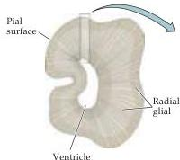
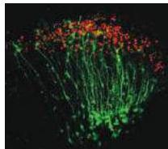
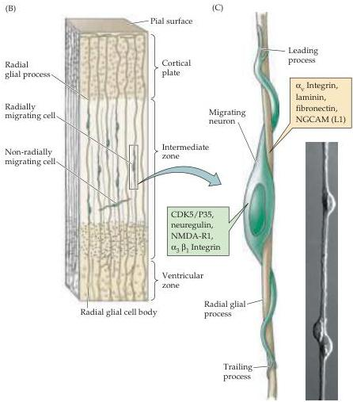

Chapter Twenty-One

(A)

Figure 21.11 Radial migration in the developing cortex.
(A) Section through the developing forebrain showing radial glial processes from the ventricular to the surfaces.
Micrograph shows migrating neurons labeled with an antibody to neuregulin, specific for migrating cortical neurons.
(B) Enlargement of boxed area in (A).
Migrating neurons are intimately apposed to radial glial cells, which guide them to their final position in the cortex.
Some cells take a nonradial migratory route, which can lead to wide dispersion of neurons derived from the same precursor (see Box F).
(C) A single neuroblast migrates upon a radial glial process (based on serial reconstruction of EM sections as well as in vitro assays of migration, as shown in the accompanying micrograph).
Cell adhesion and other signaling molecules or receptors found on the surface of either the neuron (green) or the radial glial process (tan) are indicated in the respective boxes.
(After Rakic, 1974; micrographs courtesy of E.
S.
Anton and P.
Rakic.)

observations and more recent molecular and genetic studies indicate that some forms of mental retardation, epilepsy, and other neurological problems arise from the abnormal migration of cerebral cortical neurons (see Box B in Chapter 18).

Relatively little is known about the specific messages that neurons receive as they migrate in the central nervous system.
It is apparent, however, that moving through a changing cellular environment has important consequence for the differentiation of neurons.
Such effects are most thoroughly documented in the migration of neural crest cells, where the migratory paths of precursor cells are related to both the ultimate position in the body and neuronal identity.
The distinct signals along these pathways can be secreted molecules (including some of the peptide hormones used at earlier times for neural induction), cell surface ligands and receptors (adhesion molecules and other signals), or extracellular matrix molecules (see Chapter 22).
These signals are made available from somites, visceral epithelial structures like the developing dorsal aorta, mesodermally derived mesenchymal cells, and the neural crest cells themselves.