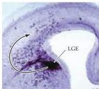
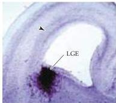
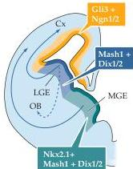

Early Brain Development

WICHTERLE, H., D.
H.
TURNBULL, S.
NERY, G.
FISHELL AND A.
ALVAREZ-BUYLLA (2001) In utero fate mapping reveals distinct migratory pathways and fates of neurons born in the mammalian basal forebrain.
Development 128: 3759-3771.

(A) Migration of cells from the ventral forebrain to the neocortex during late gestation in the mouse.
A tracer has been placed in the lateral ganglionic eminence, and labeled cells can be seen streaming toward the cortex, as well as in residence in the developing cortical plate.
(B) Schematic of transcriptional regulators associated with the primary divisions of the ganglionic eminence (lateral and medial), and the basic migratory routes taken by cells in each division (arrows).
(C) Diminished migration of cells from the ventral forebrain in mice with null mutations of both  $Dlx1$  and  $Dlx2$  (expressed throughout the lateral and medial ganglionic eminence).

(A)

(C)

(B)

# Summary

The initial development of the nervous system depends on an intricate interplay of cellular movements and inductive signals.
In addition to an early establishment of regional identity and cellular position as a result of morphogenesis, substantial migration of neuronal precursors is necessary for the subsequent differentiation of distinct classes of neurons, as well as for the eventual formation of specialized patterns of synaptic connections (see Chapter 22).
The fate of individual precursor cells is not determined simply by their mitotic history; rather, the information required for differentiation arises largely from interactions between the developing cells and the subsequent activity of distinct transcriptional regulators.
All of these events are dependent on the same categories of molecular and cellular phenomena: cell-cell signaling, changes in motility and adhesion, transcriptional regulation, and, ultimately, cell-specific changes in gene expression.
The molecules that participate in signaling during early brain development are the same as the signals used by mature cells: hormones, transcription factors, other second messengers (see Chapter 7), as well as cell adhesion molecules.
As might be expected, the identification and characterization of these molecules in the developing brain has begun to explain a variety of congenital neurological defects.
Signaling and regulation of gene expression during early neural development are especially vulnerable to the effects of genetic mutations, and to the actions of the many drugs and toxins that can compromise the elaboration of a normal nervous system.