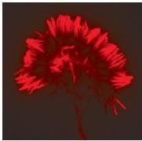
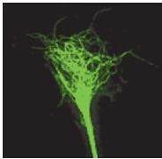
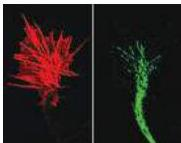
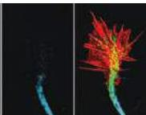
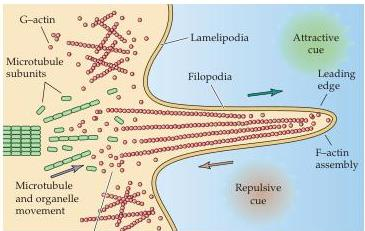

Construction of Neural Circuits 529

(A)

(B)

(C)
F-actin
depolymerization
Figure 22.1 Basic structure of the growth cone.
(A) A growth cone from a cultured sensory ganglion neuron, labeled for actin (red) and tubulin (green).
Actin predominates in the filopodial extensions of the growth cone.
Tubulin is the predominant cytoskeletal protein in the axon, extending into the lamellapodium of the growth cone.
(B) Distinct classes of actin and tubulin are seen in discrete regions.
At left, filamentous actin (F-actin; red) is enriched in the growth cone lamellapodia.
Tyrosinated microtubules are the primary constituents of the lamellar region of the growth cone (middle left; green).
Actylated microtubules are restricted to the axonal region (middle right; blue).
On the far right, a merged image shows the restricted distribution of each distinct cytoskeletal element.
(C) Distribution and dynamics of cytoskeletal elements in the growth cone.
Globular actin (G-actin) can be incorporated into F-actin at the leading edge of the filopodium in response to attractive cues.
Repulsive cues support the disassembly and retrograde flow of G-actin toward the lamellapodium.
Organized microtubules make up the cytoskeletal core of the axon, while more broadly dispersed, dynamic microtubules or microtubule subunits are found in apposition to F- and G-actin in the lamellapodium.
(A courtesy of X.
Zhou and W.
Snider; B courtesy of E.
Dent and F.
Gertler; C after Kolodkin et al., 2003.)