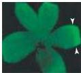
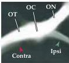
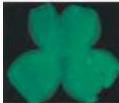
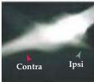
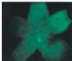
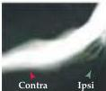

Construction of Neural Circuits 531

# References

GUILLERY, R.
W.
(1974) Visual pathways in albinos.
Sci.
Am.
230: 44-54.
GUILLERY, R.
W., C.
A.
MASON AND J.
S.
TAYLOR (1995) Developmental determinants at the mammalian optic chiasm.
J.
Neurosci.
15: 4727-4737.
HERRERA, E.
AND 8 OTHERS (2003) Zic2 patterns binocular vision by specifying the uncrossed retinal projection.
Cell 114: 545-557.

RASBAND, K., M.
HARDYV AND C.
B.
CHIEN (2003) Generating X: Formation of the optic chiasm.
Neuron 39: 885-888.
WILLIAMS, S.
E.
AND 9 OTHERS (2003) Ephrin-B2 and EphB1 mediate retinal axon divergence at the optic chiasm.
Neuron 39: 919-935.

(A) There is a small population of Zic2-expressing retinal ganglion cells (arrowheads) in the ventrotemporal region of the normal retina (at left, mounted flat by making several radial cuts).
At right, the normal projection of one eye via the optic nerve (ON), through the optic chiasm (OC), and into the optic tract (OT) has been traced using a lipophilic dye placed in one eye.
After the chiasm, labeled axons can be seen both in the contralateral (contra) as well as the ipsilateral (ipsi) optic tract.
(B) When Zic2 function is diminished in a mouse heterozygous for a Zic2 "knockdown" mutation (in which expression of Zic2 protein is diminished, but not eliminated, in the ventrotemporal retina), the number of ipsilateral axons in the optic tract is similarly diminished.
(C) When Zic2 function is further diminished in homozygous Zic2 knock-down animals, the ipsilateral projection can no longer be detected in the optic tract; thus, each of the optic tracts consist of contralateral axons.
(From Herrera et al., 2003.)

(A)  $+ / +$

(B)  $Zic2^{kd} / +$

(C)  $Zic2^{kd / kd}$

adhesion molecules with axon growth is based upon experiments either in vitro, where addition or removal of a particular molecule results in modifying the relevant behavior of growing axons, or in vivo where genetic mutation, deletion or manipulation disrupts the growth, guidance or targeting of a particular axon projection (see Box A).

Despite their daunting number, molecules that are known to influence axon growth and guidance can be grouped into families of ligands and their receptors (Figure 22.2).
The extracellular matrix molecules and their integrin receptors, the  $\mathrm{Ca^{2+}}$ -independent cell adhesion molecules (CAMs), the  $\mathrm{Ca^{2+}}$ -dependent cell adhesion molecules (cadherins), and the ephrins and eph receptors (see below) are the major classes of non-diffusible axon guidance molecules.
The extracellular matrix cell adhesion molecules were the first to be associated with axon growth.
The most prominent members of this group are the laminins, the collagens, and fibronectin.
As their family name indicates, laminin, collagen, and fibronectin are all found in a macromolecular complex or matrix outside of the cell (Figure 22.3).
The matrix components can be secreted by the cell itself or its neighbors; however, rather than diffusing away from the cell after secretion, these molecules form polymers and create a more durable local extracellular substance.
A broad class of receptors, known collectively as integrins, bind specifically to these molecules (see Figure 22.2).
Integrins themselves do not have kinase activity or other direct signaling capacity.
Instead, the binding of laminin, collagen, or