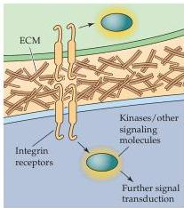
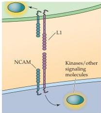
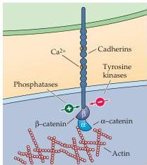
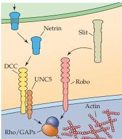
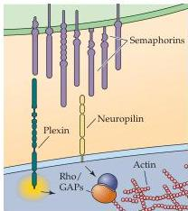
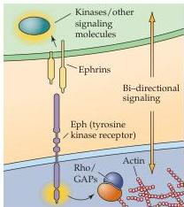

(A) Extracellular matrix molecules

(B) CAMs

(C) Cadherins

(D) Netrin/slit family

(E) Semaphorins

(F) Ephrins
Figure 22.2 Several families of ligands and receptors constitute the major classes of axon guidance molecules.
These ligand-receptor pairs can be either attractive or repulsive, depending on the identity of the molecules and the context in which they signal the growth cone.
(A) Extracellular matrix molecules serve as the ligands for multiple integrin receptors.
(B) Homophilic,  $\mathrm{Ca^{2+}}$ -independent cell adhesion molecules (CAMs) are at once ligands and receptors.
(C)  $\mathrm{Ca^{2+}}$ -dependent adhesion molecules, or cadherins, are also capable of homophilic binding.
(D) The netrin/slit family of attractive and repulsive secreted signals acts through two distinct receptors, DCC ("deleted in colorectal cancer"), which binds netrin, and robo, the receptor for slit.
(E) Semaphorins are primarily repulsive cues that can either be bound to the cell surface or secreted.
Their receptors (the plexins and neuropilin) are found on growth cones.
(F) Ephrins, which can be transmembrane- or membrane-associated, signal via the Eph receptors, which are receptor tyrosine kinases.

fibronectin to integrins triggers a cascade of events—perhaps via interactions with cytoplasmic kinases and other soluble signaling molecules—that generally stimulates growth and elongation.
These changes include fluctuations in levels of intracellular messengers such as calcium and inositol trisphosphate  $(\mathrm{IP}_3)$ , and the activation of additional intracellular kinase pathways