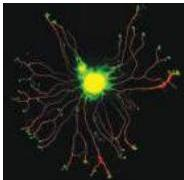
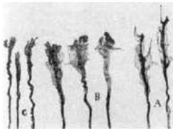
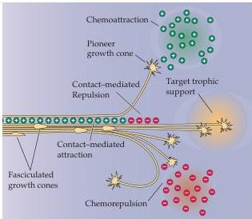

Construction of Neural Circuits 533

(A)

(B)

(C)

(see Chapter 7).
The role of extracellular matrix molecules in axon guidance is particularly clear in the embryonic periphery.
Axons extending through peripheral tissues grow through loosely arrayed mesenchymal cells that fill the interstices of the embryo, and the spaces between these mesenchymal cells are rich in extracellular matrix molecules.
Axons also grow along the interface of mesenchyme and epithelial tissues including the epidermis, where an organized sheet of extracellular matrix components called the basal lamina provides a supportive substrate.

In addition, in peripheral nerves, matrix molecules are secreted by glial cells (Schwann cells) associated with growing axons.
In tissue culture as well as in the embryo, different extracellular matrix molecules have different capacities to stimulate axon growth.
Thus, the relative availability of different matrix molecules can influence the speed or direction of a growing axon.
The role of matrix molecules in the central nervous system is less clear.
Some of the same molecules are present in the extracellular space but are not organized into orderly substrates like the basal lamina in the periphery, and have therefore been harder to study.

Figure 22.3 Growth cone interactions with the environment.
(A) Potential classes of cues and their effects on growing axons.
Attractant cues, either secreted or bound to the cell surface, can guide a growth cone to a particular domain, or help maintain growing axons as distinct bundles, or fascicles.
(B) Growth cone morphology varies in a single axon pathway.
Examples of axons at different points in their trajectory between the dorsal horn and the ventral midline.
When the axons are growing in the dorsal spinal cord, the growth cones are simple, with few apparent filopodia.
When these axons reach a "choice point" (presumably one rich in chemoattractant and repulsive cues) such as the floorplate at the ventral midline, the growth cones become more complex, with broader lamellapodia and multiple filopodial extensions.
(C) Summary of growth cone responses to the range of cues available in the environment.
(B courtesy of C.
Mason; C after Huber et al., 2003.)