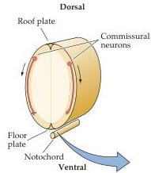
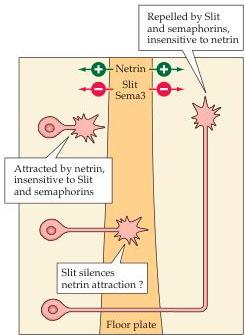
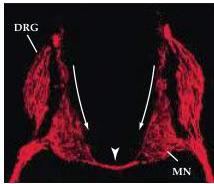
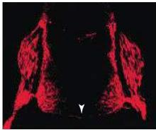

Construction of Neural Circuits

(A)

(B)

(C)

Figure 22.4 Chemotropic molecules (netrins) in the developing spinal cord.
(A) Commissural neurons send axons to the ventral region of the spinal cord, including a specific region called the floorplate.
(B) Opposing activities of netrin and slit at the ventral midline of the spinal cord.
This molecular guidance system ensures that the axons relaying pain and temperature via the anterolateral pathway cross the midline at appropriate levels of the spinal cord and remain on the contralateral side until they reach their targets in the thalamus.
(C) At left, labeled commissural axons (red) descend through the spinal cord, pass the motor column (MC), and cross the midline into the anterior (ventral) commissure of the spinal cord.
At right, the netrin gene of a mouse has been homozygously inactivated, and the commissural axons do not fasciculate, nor do they cross at the ventral midline (arrowheads).
(A after Serafini et al., 1994; B after Dickinson, 2002; C from Serafini et al., 1996.)

The best-characterized class of chemoattractant molecules is the netrins (from the Sanskrit "to guide"; Figure 22.4).
In chick embryos, the netrins were identified as proteins with chemoattractant activity following biochemical purification.
In C.
elegans, netrins were first recognized as the product of a gene that influenced axon growth and guidance (the first such gene was called Unc-6 for "uncoordinated," which describes the behavioral phenotype of the mutant worms; the cause is misrouted axons as a result of the absence of netrin).
The netrins themselves have high homology to extracellular matrix molecules like laminin (see Figure 22.2) and in some cases may actually interact with the extracellular matrix to influence directed axon growth.
Netrin signals are transduced by specific receptors including the molecule DCC (deleted in colorectal cancer) as well as other co-receptors.
Like many cell surface adhesion molecules, netrin receptors have repeated