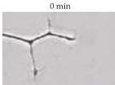
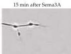
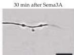
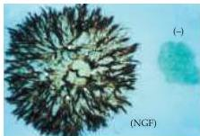
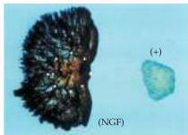

Construction of Neural Circuits

(A)

(C)

Figure 22.5 Semaphorins promote growth cone collapse and axon repulsion.
(A) Time-lapse series showing a growth cone exposed to semaphorin.
(B) In the presence of nerve growth factor (NGF), explant cultures of chick dorsal root ganglia extend halos of neurites that originate from different neuronal subpopulations.
(C) Co-culture of a ganglion with non-neuronal cells (+) transfected with the gene for semaphorin III (collapsin) results in asymmetrical growth of the ganglion cell neurites as a result of chemorepulsion.
Control cells not transfected with the gene  $[-]$  in panel B] have no effect on the pattern of outgrowth.
(A from Dontchev and Letourneau, 2002; B, C from Messersmith et al., 1995.)

(B)

important contribution to the orderly construction of axon pathways in both the periphery and in the central nervous system.

# The Formation of Topographic Maps

In the somatic sensory, visual, and motor systems, neuronal connections are arranged such that neighboring points in the periphery are represented at similarly adjacent locations in the appropriate regions of the central nervous system (see Chapters 8, 11, and 16).
In other systems (e.g., the auditory and olfactory systems), there are also orderly representations of various stimulus attributes like frequency or receptor identity.
How do growing axons distribute themselves with such fidelity within target regions in the brain?

In the early 1960s, Roger Sperry, who later did pioneering work on the functional specialization of the cerebral hemispheres (see Chapter 26), articulated the chemoaffinity hypothesis, based primarily on work in the visual system of frogs and goldfish.
In these animals, the terminals of retinal ganglion cells form a precise topographic map in the optic tectum (the tectum is homologous to the mammalian superior colliculus).
When Sperry crushed the optic nerve and allowed it to regenerate (fish and amphibians, unlike mammals, can regenerate axonal tracts in their central nervous system; see Chapter 24), he found that retinal axons reestablished the same pattern of connections in the tectum.
Even if the eye was rotated  $180^{\circ}$ , the regenerating axons grew back to their original tectal destinations (causing some behavioral confusion for the frog: Figure 22.6B).
Accordingly, Sperry proposed that each tectal cell carries an "identification tag"; he further supposed that the growing terminals of retinal ganglion cells have complementary tags, such that they seek out a specific location in the tectum.
In modern parlance, these "chemical" tags are cell adhesion or recognition molecules, and the "affinity" that they engender is a selective binding of receptor molecules on the growth cone to corresponding molecules on the tectal cells that signal their relative positions.