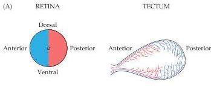
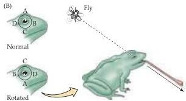
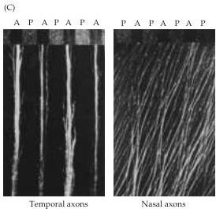
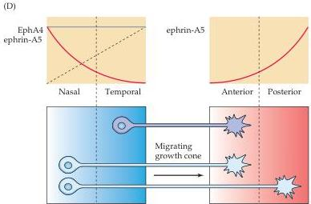

Chapter Twenty-Two

Figure 22.6 Mechanisms of topographic mapping in the vertebrate visual system.
(A) Posterior retinal axons project to the anterior tectum and anterior retinal axons to the posterior tectum.
When the optic nerve of a frog is surgically interrupted, the axons regenerate with the appropriate specificity.
(B) Even if the eye is rotated after severing the optic nerve, the axons regenerate to their original position in the tectum.
This topographic constancy is evident from the frog's behavior: When a fly is presented above, the frog consistently strikes downward, and vice versa.
(C) An in vitro assay for cell surface molecules that contribute to topographic specificity in the optic tectum.
A set of alternating stripes  $(90\mu \mathrm{m}$  wide) of membranes from anterior (A) and posterior (P) optic tectum of chicks was laid down on a glass coverslip.
The posterior membranes have fluorescent particles added to make the boundaries of the stripes apparent (top of panels).
Explants of retina from either nasal or temporal retina were placed on the stripes.
Temporal axons prefer to grow on anterior membranes and are repulsed by posterior membranes.
In contrast, nasal retinal axons grow equally well on both stripes.
(D) Complementary gradients of Eph receptors (in afferent cells and their growth cones) and ephrins (in the target cells) lead to differential affinities and topographic mapping.
In this model, a growth cone with a high concentration of Eph receptors would be more likely to recognize a lower concentration of ligand, whereas a growth cone with low Eph receptor concentration would recognize a higher concentration of ligand.
(A, B after Sperry, 1963; C from Walter et al., 1987; D after Wilkinson, 2001.)

