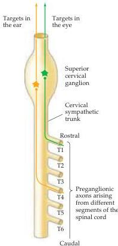

Chapter Twenty-Two

Figure 22.7 Evidence that synaptic connections between mammalian neurons form according to specific affinities between different classes of pre- and postsynaptic cells.
In the superior cervical ganglion, preganglionic neurons located in particular spinal cord segments (T1, for example) innervate ganglion cells that project to particular peripheral targets (the eye, for example).
Establishment of these preferential synaptic relationships indicates that selective neuronal affinities are a major determinant of neural connectivity.

in the innervation of muscle fibers (Box B) and autonomic ganglion cells by spinal cord motor neurons.
Synaptic specificity was first explored by British physiologist John Langley at the end of the nineteenth century.
Preganglionic sympathetic neurons located at different levels of the spinal cord innervate cells in sympathetic chain ganglia in a stereotyped and selective manner (Figure 22.7; see also Chapter 20).
In the superior cervical ganglion, for example, cells from the highest thoracic level (T1) innervate ganglion cells that project in turn to targets in the eye, whereas neurons from a somewhat lower level (T4) innervate ganglion cells that cause constriction of the blood vessels of the ear.
Since the axons of all these neurons run together in the cervical sympathetic trunk to arrive at the ganglion, the mechanisms underlying the differential innervation of the ganglion cells must occur at the level of synapse formation rather than axon guidance to the general vicinity of target cells (see above).
Anticipating Sperry by more than 50 years in a different context, Langley concluded that selective synapse formation is based on differential affinities of the pre- and postsynaptic elements.

Subsequent studies based on intracellular recordings from individual neurons in the superior cervical ganglion have shown, however, that the selective affinities between pre- and postsynaptic neurons are not especially restrictive.
Thus, synaptic connections to ganglion cells made by preganglionic neurons of a particular spinal level are preferred, but synaptic contacts from neurons at other levels are not excluded (much like the rules that govern axon guidance).
Furthermore, if the innervation to the superior cervical ganglion from a particular spinal level is surgically interrupted, recordings made some weeks later indicate that new connections are established by residual axons arising from what would normally be inappropriate spinal segments.
The novel connections also establish a pattern of segmental preferences, as if the system had attempted to achieve the best match it could under the altered circumstances.
Despite this relative selectivity during synapse formation, a quite different line of work has shown that where a synapse forms on the target cell (at least if the cell is a muscle fiber) is tightly controlled by a set of molecules that are now understood in some detail (see Box B).
Perhaps not surprisingly, these molecules include variants of several of the cell adhesion molecules that influence growth cone behavior (see below).

There are some absolute restrictions to synaptic associations.
Thus, neurons do not innervate nearby glial or connective tissue cells, and many instances have been described in which various nerve and target cell types show little or no inclination to establish connections with one another.
When synaptogenesis does proceed, however, neurons and their targets in both the central and peripheral nervous systems appear to associate according to a continuously variable system of preferences—much like the old song "if you can't be with the one you love, love the one you're with." Such biases guide the pattern of innervation that arises in development (or reinnervation) without limiting it in any absolute way.
The target cells residing in muscles, autonomic ganglia, or elsewhere are certainly not equivalent, but neither are they unique with respect to the innervation they can receive.
This relative promiscuity can cause problems following neural injury, since regenerated patterns of peripheral innervation are not always appropriate (see Chapter 24).

Several observations show that many of the same adhesion molecules that participate in axon guidance contribute to the identification and stabilization of a synaptic site on target cells, as well as to the ability of a growing axon to recognize specific sites as optimal.
Ephrins have been suggested to contribute to this process, as have cadherins.
In both cases the diversity of ligands and receptors makes these adhesion molecule families attractive candi