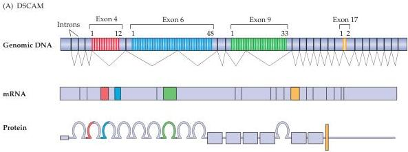
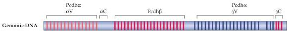
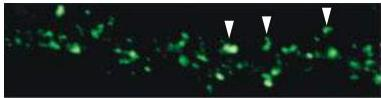
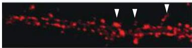
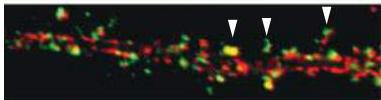

Construction of Neural Circuits

dates.
This speculation has an intriguing parallel in Drosophila.
In the fly, the gene for the cell adhesion molecule DSCAM (the fly ortholog of the mammalian down syndrome cell adhesion molecule, the gene for which is located on chromosome 21, the chromosome that is duplicated in Down syndrome) has approximately 38,000 isoforms based upon the numbers of exons in the gene and predicted splicing (Figure 22.8A).
In the fly, DSCAM is expressed at synaptic sites in the developing nervous system.
It is not yet clear whether or not individual splice isoforms are differentially expressed at distinct synaptic sites; however, if this is the case, the genomic diversity may contribute

(A) DSCAM

(B) Gamma protocadherin

(C)

Figure 22.8 Potential molecular mediators of synapse identity.
(A) Organization of the DSCAM gene in Drosophila.
Each of four multiple-exon regions (4, 6, 9, and 17) has several alternative splice variants, and different combinations of these four regions yields a potential 37,000 isoforms of the DSCAM protein that can be expressed at distinct synaptic sites in the fly's developing nervous system.
(B) Similar variability of multiple alternative exons is seen in the mammalian gene for  $\gamma$ -protocadherin.
(C) Distinct  $\gamma$ -protocadherin isoforms (green) are expressed at subsets of synaptic contacts on dendrites of hippocampal neurons in culture, suggesting that different synaptic sites may have different complements of adhesion molecules perhaps conferring specificity to those synaptic junctions.
(A after Schmucker et al., 2000; B after Wang et al., 2002; C from Phillips et al., 2003.)