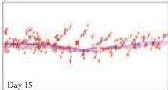
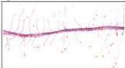
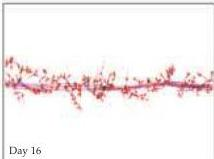
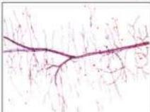
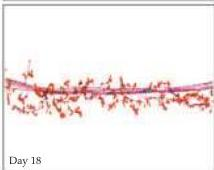
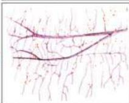

Chapter Twenty-Two

# Box B

## Molecular Signals That Promote Synapse Formation

Synapses require a precise organization of presynaptic and postsynaptic elements in order to function properly (see Chapters 4-7).
At the neuromuscular junction, for example, synaptic vesicles and the related release machinery are located at sites in the nerve terminal called active zones; and, in the postsynaptic muscle cell, acetylcholine receptors and other synapse-specific molecules are localized in high density exactly subjacent to the presynaptic active zones.
During the past 25 years, a number of investigators have identified some of the molecular cues that guide the formation of these carefully apposed elements.
Their efforts have met with the greatest success at the neuromuscular junction, where a molecule called agrin is now known to be responsible for initiating some of the events that lead to the formation of a fully functional synapse.

Agrin was originally identified as a result of its influence in the reinnervation of frog neuromuscular junctions following damage to the motor nerve.
In mature skeletal muscle, each fiber typically receives a single synaptic contact at a highly specialized region called the end plate (see Chapter 5).
U.
J.
McMahan, Josh Sanes, and their colleagues at Harvard and later Stanford and Washington Universities found that regenerating axons reinnervate the original end plate site precisely.
In seeking to determine the molecular signals underlying this phenomenon, they took advantage of the fact that each muscle fiber is surrounded by a sheath of extracellular matrix called the basal lamina.
When muscle fibers degenerate, they leave the basal lamina behind (as do degenerating axons); moreover, a specific infolding of the basal lamina at the former end plate site allows its continued identification.
Remarkably, presynaptic nerve terminals differentiate at these original sites even when the associated muscle fibers are absent.
Equally remarkable is that regenerating muscle fibers form postsynaptic specializations—such as densely packed acetylcholine receptors—at precisely these same basal lamina locations in the absence of nerve fibers! These findings show that the signal(s) guiding synapse formation remain in the extracellular environment after removal of either nerve or muscle, presumably in the basal lamina "ghost" that surrounds each muscle fiber.

Using a bioassay based on the aggregation of acetylcholine receptors to analyze the constituents of the basal lamina,

Control

Agrin-deficient

Development of neuromuscular junctions in agrin-deficient mice.
Diaphragm muscles from control (left) and agrin-deficient (right) mice at embryonic day 15, 16, and 18 were double-stained for acetylcholine receptors and axons, then drawn with a camera lucida.
The developing muscle fibers run vertically.
In both control and mutant muscles, an intramuscular nerve (black) and aggregates of AChRs (red) are present by embryonic day 15.
In controls, axonal branches and AChR clusters are confined to a band at the central end plate at all stages.
Mutant AChR aggregates are smaller, less dense, and less numerous; axons form fewer branches and their synaptic relationships are disorganized.
(From Gautam et al., 1996.)

