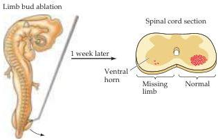
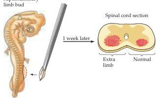

Chapter Twenty-Two

(A)
(B)

(C)
Transplantation of supernumerary limb bud
Figure 22.9 Effect of removing or augmenting neural targets on the survival of related neurons.
(A) Limb bud amputation in a chick embryo at the appropriate stage of development (about 2.5 days of incubation) depletes the pool of motor neurons that would have innervated the missing extremity.
(B) A cross section of the lumbar spinal cord in an embryo that underwent this surgery about a week earlier.
The motor neurons (dots) in the ventral horn that would have innervated the hindlimb degenerate almost completely after embryonic amputation; a normal complement of motor neurons is present on the other side.
(C) Adding an extra limb bud before the normal period of cell death rescues neurons that normally would have died.
(D) Such augmentation leads to an abnormally large number of limb motor neurons (dots) on the side related to the extra limb.
(After Hamburger, 1958, 1977, and Hollyday and Hamburger, 1976.)

for short) are unique in that, unlike inductive signaling molecules and cell adhesion molecules, their expression is limited primarily to neurons as well as some non-neural targets like muscles, and they are first detected after the initial populations of postmitotic neurons have been generated in the nascent central and peripheral nervous systems.

Why should neurons depend so strongly on their targets, and what specific cellular and molecular interactions mediate this dependence? The answer to the first part of this question lies in the changing scale of the developing nervous system and the body it serves, and the related need to precisely match the number of neurons in particular populations with the size of their targets.
The basic mechanisms by which neurons are initially generated have already been considered in Chapter 21.
There is, however, one more issue in generating the final complement of neurons.
A general—and surprising—strategy in the development of vertebrates is the production of an initial surplus of nerve cells (on the order of two- or threefold); the final population is subsequently established by the death of those neurons that fail to interact successfully with their intended targets (see below).
The elimination of supernumerary neurons is now known to be mediated by neurotrophic factors.

Evidence that targets play a major role in determining the size of the neuronal populations that innervate them has come from an ongoing series of studies dating from the start of the twentieth century.
The seminal observation was that the removal of a limb bud from a chick embryo results, at later embryonic stages, in a striking reduction in the number of nerve cells (α motor neurons) in the corresponding portions of the spinal cord (Figure 22.9A,B).
These supernumerary neurons die due to a lack of trophic support.
The interpretation of these experiments is that neurons, in the spinal cord in this case, compete with one another for a resource present in the target (the developing limb) that is available in limited supply.
In support of this idea, many neurons that would normally have died can be rescued by augmenting the amount of target available—in this example, by adding another limb that can be innervated by the same spinal segments that innervate the normal limb—thereby providing extra trophic support (Figure 22.9C,D).
Thus, the size of nerve cell populations in the adult is not fully determined in advance by a rigid genetic program.
It can be modified by idiosyncratic neuron-target interactions in each developing individual.