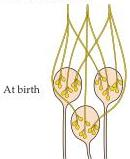
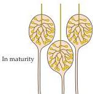
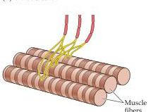
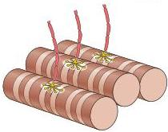

Construction of Neural Circuits 545

# Further Competitive Interactions in the Formation of Neuronal Connections

Once neuronal populations are established by this winnowing, trophic interactions continue to modulate the formation of synaptic connections, beginning in embryonic life and extending far beyond birth.
Among the problems that must be solved during the establishment of innervation is ensuring that each target cell is innervated by the right number of axons, and that each axon innervates the right number of target cells.
Getting these numbers right is another major achievement of trophic interactions between developing neurons and target cells, and is necessary for establishing appropriate circuits to support specific functional demands of each individual organism.

Studying synaptic refinement in the complex circuitry of the cerebral cortex or other regions of the central nervous system is a formidable challenge.
As a result, many basic ideas about the ongoing modification of developing brain circuitry have come from simpler, more accessible systems, most notably the vertebrate neuromuscular junction and autonomic ganglion cells (Figure 22.10).
Adult skeletal muscle fibers and neurons in some classes of autonomic ganglia (parasympathetic neurons) are each innervated by a single axon.
Initially, however, each of these target cells is innervated by axons from several neurons, a condition termed polyneuronal innervation.
In such cases, inputs are gradually lost during early postnatal development until only one remains.
This process of loss is generally referred to as synapse elimination, although the elimination actually refers to a reduction in the number of different axonal inputs to the target cells, not to a reduction in the overall number of synapses made on the postsynaptic cells.
In fact, the overall number of synapses (individual specialized sites for release of neurotransmitter) in the peripheral nervous system increases steadily during the course of develop-

(A) Ganglion cells

(B) Muscle cells

Figure 22.10 Major features of synaptic rearrangement during the first few weeks of postnatal life in the mammalian peripheral nervous system.
In ganglia comprising neurons without dendrites (A) and in muscles (B), each axon innervates more target cells at birth than in maturity.
In both muscles and ganglia, however, the size and complexity of the terminal arbor on each target cell increases.
Thus, each axon elaborates more and more terminal branches and synaptic endings on the target cells it will innervate in maturity.
The common denominator of this process is not a net loss of synapses, but the focusing by each axon of a progressively increasing amount of synaptic machinery on fewer target cells.
(After Purves and Lichtman, 1980.)