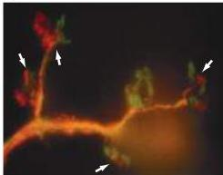
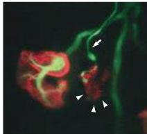
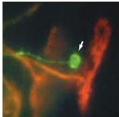

Chapter Twenty-Two

ment, as is the case throughout the brain.
A variety of experiments have shown that the elimination of some initial inputs to muscle and ganglion cells is a process in which synapses originating from different neurons compete with one another for "ownership" of an individual target cell (see Box B).

Importantly, such competition is thought to be modulated by patterns of electrical activity in the pre- and postsynaptic partners.
For example, if acetylcholine receptors at the neuromuscular junction are blocked by curare (a potent antagonist of the acetylcholine receptor; see Chapter 6), polyneuronal innervation persists.
Blocking presynaptic action potentials in the motor neuron axons (by silencing the nerve with tetrodotoxin, a sodium channel blocker) also prevents the reduction of polyneuronal innervation.
Blocking neural activity, therefore, reduces (or delays) competitive interactions and the associated synaptic rearrangements.

The object of this competition is not known.
Some of the phenomena of activity-dependent competition in muscles and autonomic ganglia (as well as in more complex central nervous system structures) could be explained by postulating that (1) synapses require a certain minimal level of trophic support to persist, (2) the relevant factors are secreted in limited amounts by the postsynaptic (target) cells in response to synaptic activation, and (3) synapses can only avail themselves of trophic support if their activity and that of the target cell coincide.
There is, however, little direct evidence for this scenario.
Equally plausible is the idea that active synapses provide a destabilizing signal that weakens asynchronously firing inputs.
Thus, how activity achieves its effects on synaptic connectivity remains a key question.

The most useful insights into the nature of synaptic rearrangement during development have come from direct observation of this process (Figure 22.11).
Using different-colored fluorescent dyes that stain either the presynaptic terminal or the postsynaptic receptors synaptic rearrangement Jeff Lichtman and his colleagues have followed the same neuromuscular junction over days, weeks, or longer.
These observations have yielded some unexpected results.
Competition between synapses arising from different motor neurons does not involve the active displacement of the "losing" input by the eventual "winner." Instead, it appears that the inputs of the two competitors gradually segregate.
The "losing" axon then atrophies and retracts from the synaptic site.
This is accomplished by a loss of the corresponding postsynaptic specializations associated with the "loser." Neurotransmitter receptors beneath the terminal branches that eventually will be eliminated are also lost.
This receptor loss occurs before the nerve terminal

Figure 22.11 Synapse elimination at neuromuscular junctions.
(A) Several neuromuscular junctions (arrows) from a mouse fetus (embryonic day 17).
The red and green terminals are synapses from two different axons that converge at each of several junctions.
(B) A single neuromuscular junction at higher magnification during a late stage of competition in which one of the synaptic inputs is close to elimination (white arrow).
The "losing" input has completely segregated from the other axon, and the synaptic area on the muscle fiber that it occupies (labeled red with an acetylcholine antibody) is disappearing as the nerve is being eliminated (arrowheads).
(C) This image illustrates the outcome of synaptic competition just after the losing axon (green) has withdrawn, leaving a red axon and its terminal.
Note that the "loser" (green axon) has a retraction bulb at the end (arrow), and the "winning" axon (red) is significantly thicker.
(Courtesy of J.
W.
Lichtman.)

(A)

(C)