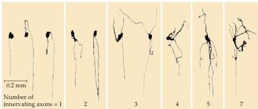
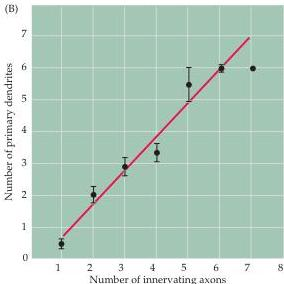

Box C

# Why Do Neurons Have Dendrites?

Perhaps the most striking feature of neurons is their diverse morphology.
Some classes of neurons have no dendrites at all; others have a modest dendritic arborization; still others have an arborization that rivals the complex branching of a fully mature tree (see Figures 1.2 and 1.6).
Why should this be? Although there are many reasons for this diversity, neuronal geometry influences the number of different inputs that a target neuron receives by modulating competitive interactions among the innervating axons.

Evidence that the number of inputs a neuron receives depends on its geometry has come from studies of the peripheral autonomic system, where it is possible to stimulate the full complement of axons innervating an autonomic ganglion and its constituent neurons.
This approach is not usually feasible in the central nervous system because of the anatomical complexity of most central circuits.
Since individual postsynaptic neurons can also be labeled via an intracellular recording electrode, electrophysiological measurements of the number of different axons innervating a neuron can routinely be correlated with target cell shape.
In both parasympathetic and sympathetic ganglia, the degree of preganglionic convergence onto a neuron is proportional to its dendritic complexity.
Thus, neurons that lack dendrites altogether are generally innervated by a single input, whereas neurons with increasingly complex dendritic arborizations are innervated by a proportionally greater number of different axons (see figure).
This correlation of neuronal geometry and input number holds within a single ganglion, among different ganglia in a single species, and among homologous ganglia across a range of species.
Since ganglion cells that have few or no dendrites are initially innervated by several different inputs (see text), confining inputs to the limited arena of the developing cell soma evidently enhances competition between them, whereas the addition of dendrites to a neuron allows multiple inputs to

(A)

(B)

The number of axons innervating ciliary ganglion cells in adult rabbits.
(A) Neurons studied electrophysiologically and then labeled by intracellular injection of a marker enzyme have been arranged in order of increasing dendritic complexity.
The number of axons innervating each neuron is indicated.
(B) This graph summarizes observations on a large number of cells.
There is a strong correlation between dendritic geometry and input number.
(After Purves and Hume, 1981.)

persist in peaceful coexistence.
Importantly, the dendritic complexity of at least some classes of autonomic ganglion cells is influenced by neurotrophins.

A neuron innervated by a single axon will clearly be more limited in the scope of its responses than a neuron innervated by 100,000 inputs (1 to 100,000 is the approximate range of convergence in the mammalian brain).
By regulating the number of inputs that neurons receive, dendritic form greatly influences function.

# References

HUME, R.
I.
AND D.
PURVES (1981) Geometry of neonatal neurons and the regulation of synapse elimination.
Nature 293: 469-471.

PURVES, D.
AND R.
I.
HUME (1981) The relation of postsynaptic geometry to the number of presynaptic axons that innervate autonomic ganglion cells.
J.
Neurosci.
1: 441-452.

PURVES, D.
AND J.
W.
LICHTMAN (1985) Geometrical differences among homologous neurons in mammals.
Science 228: 298-302.

PURVES, D., E.
RUBIN, W.
D.
SNIDER AND J.
W.
LICHTMAN (1986) Relation of animal size to convergence, divergence and neuronal number in peripheral sympathetic pathways.
J.
Neurosci.
6: 158-163.

SNIDER, W.
D.
(1988) Nerve growth factor promotes dendritic arborization of sympathetic ganglion cells in developing mammals.
J.
Neurosci.
8: 2628-2634.