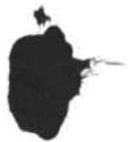
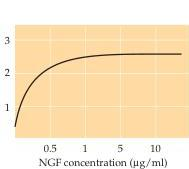
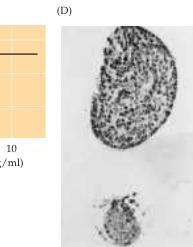

Chapter Twenty-Two

Figure 22.12 Effect of NGF on the outgrowth of neurites.
(A) A chick sensory ganglion taken from an 8-day-old embryo and grown in organ culture for 24 hours in the absence of NGF.
Few, if any, neuronal branches grow out into the plasma clot in which the explant is embedded.
(B) A similar ganglion in identical culture conditions 24 hours after the addition of NGF to the medium.
NGF stimulates a halo of neurite outgrowth from the ganglion cells.
(C, D) Effect of NGF on the survival of sympathetic ganglion cells.
(C) The survival of newborn rat sympathetic ganglion cells grown in culture for 30 days evaluated quantitatively as a function of NGF concentration.
Dose-response curves such as this one confirm the strict dependence of these neurons on the availability of NGF.
(D) Cross section of a superior cervical ganglion from a normal 9-day-old mouse (top) compared to a similar section from a littermate injected daily since birth with NGF antiserum (bottom).
The ganglion of the treated mouse shows marked atrophy, with obvious loss of nerve cells.
(A, B from Purves and Lichtman, 1985, courtesy of R.
Levi-Montalcini; C after Chun and Patterson, 1977; D from Levi-Montalcini, 1972.)

by sympathetic and sensory ganglia, but not in the ganglia themselves or in targets innervated by other types of nerve cells.
As might be expected from such specificity, the NGF-sensitive neurons were also shown to have receptor molecules for the trophic factor (see next section).
Importantly, the NGF message appears only after ingrowing axons have reached their targets; this fact makes it unlikely that secreted NGF acts in vivo as a chemotropic (guidance) molecule (like netrins and other cell adhesion molecules discussed earlier).
Finally, the great majority of sympathetic neurons are lacking in mice in which the gene encoding NGF has been deleted.

In sum, several decades of work in a number of laboratories have shown that NGF mediates cell survival among two specific neuronal populations in birds and mammals (sympathetic neurons and a subpopulation of sensory ganglion cells).
These observations include the death of the relevant neurons in the absence of NGF; the survival of a surplus of neurons in the presence of augmented levels of the factor; the presence and production of NGF in neuronal targets; and the existence of receptors for NGF in innervating nerve terminals.
Indeed, these observations define the criteria that must be satisfied in order to conclude that a given molecule is indeed a neurotrophic factor.

Although NGF remains the most thoroughly studied neurotrophic factor, it was apparent from the outset that only certain classes of nerve cells respond to NGF.
Work from a number of laboratories in the late 1980's and early 1990's has shown that NGF is only one member of a family of related trophic molecules, the neurotrophins.
At present, there are three well-char