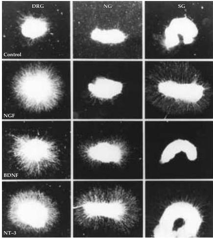
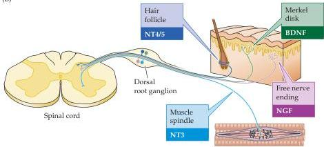

Construction of Neural Circuits 551

(A)

(B)

acterized members of the neurotrophin family in addition to NGF: brain-derived neurotrophic factor (BDNF), neurotrophin-3 (NT-3), and neurotrophin 4/5 (NT-4/5) (Box D).
Although several neurotrophins are homologous in amino acid sequence and structure, they are very different in their specificity (Figure 22.13).
For example, NGF supports the survival of (and neurite outgrowth from) sympathetic neurons, while another family member—BDNF—cannot.
Conversely, BDNF, but not NGF, can support the sur