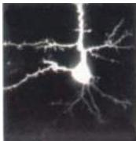
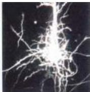

Chapter Twenty-Two

# Box D

## The Discovery of BDNF and the Neurotrophin Family

During the 30 years or so that work with NGF showed it to fulfill all the criteria for a target-derived neurotrophic factor (see text), it became clear that NGF affected only a few specific populations of peripheral neurons.
It was therefore presumed that other neurotrophic factors must exist that followed similar rules, but supported the survival and growth of other classes of neurons.
In particular, whereas NGF was shown to be secreted by the peripheral targets of primary sensory and sympathetic neurons, other factors were presumably produced by target neurons in the brain and spinal cord that supported the central projections of sensory neurons.

The serendipity of the mouse salivary gland and its extraordinary levels of NGF was not repeated for these additional factors, however, and the hunt for the neurotrophic factors presumed to act in the central nervous system proved to be a long and arduous one.
Indeed, it was not until the 1980s that the pioneering work of Yves Barde, Hans Thoenen, and their colleagues succeeded in identifying and purifying a factor from the brain that they named brain-derived neurotrophic factor (BDNF).
As with NGF, this factor was purified on the basis of its ability to promote the survival and neurite outgrowth of sensory neurons.
However, BDNF is expressed at such vanishingly small levels that over a million-fold purification was necessary before the protein could be identified!

Thereafter, microsequencing and recombinant DNA technology allowed rapid progress even from the scant amounts of purified BDNF protein that were available.
By 1989, Barde's group had succeeded in cloning the cDNA for BDNF.
Surprisingly—despite its entirely different origin and distinct neuronal specificity—BDNF turned out to be a close relative of NGF.
Based on the homologies between the primary structures of NGF and BDNF, the following year six independent laboratories (including Barde's) reported the cloning of a third member of the neurotrophin family, neurotrophin-3 (NT-3).
At present, four members of the neurotrophin family have been reported in a variety of vertebrate species (see text).

Experiments on BDNF and other members of the neurotrophin family over last decade have supported the conclusion that the survival and growth of different neuronal populations in both the PNS and CNS is dependent on different neurotrophins, relationships that are mediated by expression of membrane receptors that are specific for each neurotrophin (see figure).
However, the dramatic relationship between the survival of neuronal populations and neurotrophins has not been found in the CNS, where BDNF, NT-3, and NT-4/5, as well as their receptors, are primarily expressed.
The most striking demonstration of this difference has been in "knockout" mice in which individual genes encoding neurotrophins or Trk receptors have been deleted: While these genetic deletions have led to predictable deficits in the PNS (see text), they have generally had minimal impact on CNS structure and function.

Thus, the part played by neurotrophins in the CNS remains much less certain.
One possibility is that these neurotrophins are more involved in regulating neuronal differentiation and phenotype in the CNS than in supporting neuronal survival per se.
In this regard, the expression of neurotrophins is tightly regulated by electrical and synaptic activity, suggesting that they may also influence experience-dependent processes during the formation of circuits in the CNS.

## References

HOFER, M.
M.
AND Y.-A.
BARDE (1988) Brain-derived neurotrophic factor prevents neuronal death in vivo.
Nature 331: 261-262.
HOHN, A., J.
LEIBROCK, K.
BAILEY AND Y.
-A.
BARDE (1990) Identification and characterization of a novel member of the nerve growth factor/brain-derived neurotrophic factor family.
Nature 344: 339-341.
HORCH, H.
W., A.
KRUITTGEN, S.
D.
PORTBURY AND L.
C.
KATZ (1999) Destabilization of cortical dendrites and spines by BDNF.
Neuron 23: 353-364.
LEIBROCK, J.
AND 7 OTHERS (1989) Molecular cloning and expression of brain-derived neurotrophic factor.
Nature 341: 149-152
SNIDER, W.
D.
(1994) Functions of the neurotrophins during nervous system development: What the knockouts are teaching us.
Cell 77: 627-638.

Neurotrophins influence dendritic arbors in the developing cerebral cortex.
The cell on the left was transfected with the gene for green fluorescent protein (GFP) alone, the one on the right with GFP plus the gene encoding BDNF.
Within a day, BDNF-transfected neurons grow elaborate dendritic branches, reminiscent of the NGF-induced halo in peripheral ganglia (see Figure 22.12B).
(From Horch et al., 1999.)