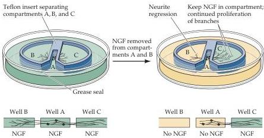

Construction of Neural Circuits 553

vival of certain sensory ganglion neurons, which have a different embryonic origin.
NT-3 supports both of these populations.
Given the diverse systems whose growth and connectivity must be coordinated during neural development, this specificity makes good sense.

Figure 22.14 Evidence that NGF can influence neurite growth by local action.
Three compartments of a culture dish (A, B, C) are separated from one another by a plastic divider sealed to the bottom of the dish with grease.
Isolated rat sympathetic ganglion cells plated in compartment A can grow through the grease seal and into compartments B and C.
(A magnified view looking down on the compartments is shown below.) Growth into a lateral chamber occurs as long as the compartment contains an adequate concentration of NGF.
Subsequent removal of NGF from a compartment causes a local regression of neurites without affecting the survival of cells or neurites in the other compartments.
These observations show that neuritic growth can be locally controlled by neurotrophins.
(After Campenot, 1981.)

# Neurotrophin Signaling

All of the biological observations on neurotrophic interactions suggest that signaling via the neurotrophins will activate at least 3 different kinds of responses: cell survival/death, synapse stabilization/elimination, and process growth/retraction.
This impression was initially generated by experiments that presented NGF to subsets of neural processes without exposing the cell body to the factor (Figure 22.14).
The result of this experiment indicated that NGF could act locally to stimulate neurite growth—even while other processes of the same cell, deprived of NGF, are retracting.
In addition, physiological experiments indicated that NGF and other neurotrophins could influence synaptic activity and plasticity, again independent of their effects on cell survival.
Thus, there is a high degree of selectivity of neurotrophin actions, depending on the neurotrophic factor available, the stage of differentiation of the responding neuron as well as the cellular domains where neurotrophic signaling takes place.

The selective actions of the neurotrophins arise from their interactions with two classes of receptors: the Trk (for tyrosine kinase) receptors and the p75 receptor.
There are three Trk receptors, each of which is a single transmembrane protein with a cytoplasmic tyrosine kinase domain.
TrkA is primarily a receptor for NGF, TrkB a receptor for BDNF and NT-4/5, and TrkC a receptor for NT-3 (Figure 22.15).
In addition, all neurotrophins can activate the p75 receptor protein.
The interactions between neurotrophins and p75 demonstrate another level of selectivity and specificity of neurotrophin signaling.
All neurotrophins are secreted in an unprocessed form that undergoes subsequent proteolytic cleavage.
The p75 receptor has high affinity for unprocessed neurotrophins, and low affinity for the processed ligands, while the Trk receptors have high affinity for processed ligands only.
The expression of a particular Trk receptor subtype or p75 therefore confers the capacity to respond to the corresponding neurotrophin.
Since neurotrophins, Trk