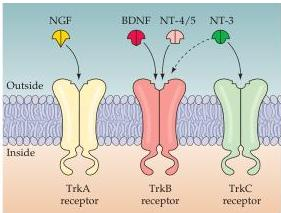
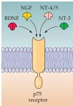

Chapter Twenty-Two

Figure 22.15 Neurotrophin receptors and their specificity for the neurotrophins.
(A) The Trk family of receptor tyrosine kinases for the neurotrophins.
TrkA is primarily a receptor for NGF, TrkB a receptor for BDNF and NT-4/5, and TrkC a receptor for NT-3.
Because of the high degree of structural homology among both the neurotrophins and the Trk receptors, there is some degree of cross-activation between factors and receptors.
For example, NT-3 can bind to and activate TrkB under some conditions, as indicated by the dashed arrow.
These distinct receptors allow various neurons to respond selectively to the different neurotrophins.
(B) The p75 low-affinity neurotrophin receptor binds all neurotrophins at low affinities (as its name implies).
This receptor confers the ability to respond to a broad range of neurotrophins upon fairly broadly distributed classes of neurons in the peripheral and central nervous systems.

(A)
(B)

receptors and p75 are expressed only in subsets of neurons, the selective binding between ligand and receptor accounts for the specificity of the relevant neurotrophic interactions.

Signaling via either the Trk receptors or the p75 receptor can lead to changes in the three domains that are sensitive to neurotrophic signaling: cell survival/death, cell and process growth/differentiation, and activity dependent synaptic stabilization or elimination.
Each receptor class (Trk or p75) can engage distinct intracellular signaling cascades that lead to changes in cell state (motility, adhesion, etc.) or gene expression and thus result in the known consequences of neurotrophic interactions (Figure 22.16).
Thus, understanding the specific effects of neurotrophic interactions for any cell relies on at least three pieces of information: the neurotrophins locally available, the combination of receptors on the relevant neuron, and the intracellular signaling pathways expressed by that neuron.
The subtlety and diversity of neuronal circuits is thus set during development by different combinations of neurotrophins, their receptors, and signal transduction mechanisms that in concert determine the numbers of neurons, their shape, and their patterns of connections.
Presumably, disruption of these neurotrophin-dependent processes, either during development or in the adult brain, can result in neurodegenerative conditions in which neurons die due to lack of appropriate trophic support, with devastating consequences for the circuits that the cells define, and the behaviors that are controlled by those circuits.
Indeed, the pathogenic mechanisms of neurodegenerative diseases as diverse as amyotrophic lateral sclerosis (ALS), Parkinson's, Huntington's, and Alzheimer's diseases may all reflect deficiencies of neurotrophic regulation.

## Summary

Neurons in the developing brain must integrate a variety of molecular signals in order to determine where to send their axons, whether to live or die, what cells to form synapses on, how many synapses to make, and whether